# Harbor installation and operations manual

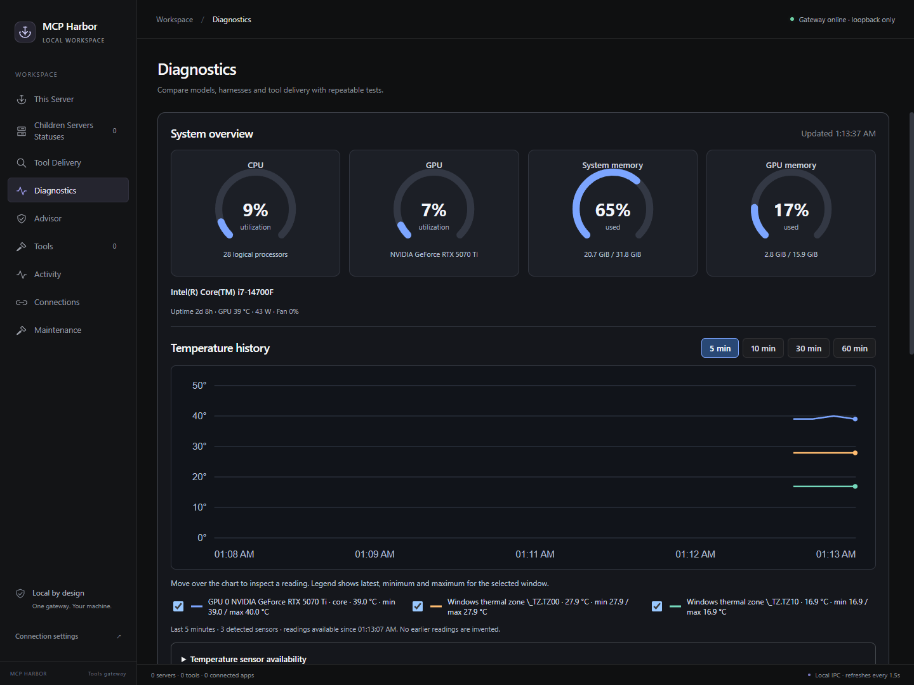

Author: **Christopher Sorrells (csorrells42)** · [clsorrells42@gmail.com](mailto:clsorrells42@gmail.com)

This is the full source for the packaged PDF manual.

## 1. Start here

Harbor is a desktop control center and a shared gateway for Model Context Protocol (MCP) tools. It starts and supervises tool servers, gives compatible clients one connection point, and lets you choose how a model discovers and calls tools. It also provides gateway API-key authentication, controlled harness diagnostics and live hardware monitoring. Harbor does not supply a chat model or replace the AI application that uses its tools.

This manual covers the Harbor application and the Windows x64 Portable toolbox. The public project is [csorrells42/Harbor](https://github.com/csorrells42/Harbor). The Portable distribution includes additional runtimes and third-party tool packages. A source checkout builds the Harbor application; it is not the complete preassembled toolbox.

Read **Quickstart** for an existing Portable installation, **Installation and relocation** for a new machine, **Connections** for client integration, and **Maintenance** before updating components. The subsystem and configuration references explain the operational boundaries needed for custom setups.

The screenshots show the running application with a fresh profile. Empty server, connection or campaign panels illustrate setup states; they are not evidence of a completed diagnostic run. Hardware readings belong to the capture computer and moment. Your configured Portable toolbox, connected clients and available sensors can differ.

### Path conventions

`<Harbor folder>` means the folder containing `Start Harbor.vbs`, `portable.json`, `application`, `packages`, `runtimes`, `support` and `data`. It can be placed in a user-writable location such as `C:\Tools\Harbor Portable`. Paths in this manual are examples; **This Server** and **Connections** display the authoritative paths and endpoints for the running instance.

`${HARBOR_ROOT}` is Harbor's literal portable-root substitution token. Do not replace it with a particular user's path in portable manifests. In PowerShell, write such tokens inside single-quoted strings when you need them to remain literal. JSON examples require doubled backslashes for Windows paths.

`<project folder>` is a workspace you own and intend a server to access. It is separate from Harbor's application folder. A client is the AI application or harness connected to Harbor. A child/upstream is an MCP server managed or connected by Harbor. A delivery mode controls tool discovery, not access permissions.

### What is ready and what still needs an account

The current Portable installation has a configured toolbox and built-in maintenance recipes. Individual tools can require external services, project selection, language servers, network access or credentials. Harbor gateway authentication is configured in This Server and is separate from third-party credentials. The intentionally deferred upstream setup is the Brave Search API key. The Brave package can be installed and verified while live Brave searches remain unavailable. GitHub authentication belongs to the local operating-system account and is not included in the distributable project.

Diagnostic model/harness quality is established by actual campaigns, not by an installed package or a green build. Cloud semantic providers need their own working credentials; local protocol tests do not validate a real provider account. The release verification appendix separates these conditions from implemented functionality.

## 2. Quickstart

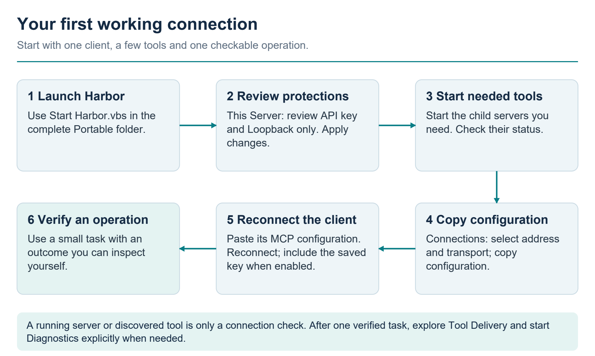

Follow the connection path first, then explore delivery modes and Diagnostics. Each stage establishes something different: an online gateway and discovered tools are prerequisites, while the final check verifies an actual operation.

### Use an existing Portable bundle

1. Extract the full Harbor Portable bundle into a user-writable folder. Keep its directory structure intact. Do not run a lone executable copied away from its resources, runtimes and packages.
2. Double-click **Start Harbor.vbs**. Use **Start Harbor.cmd** if you want to launch from a command prompt. Allow initial discovery to finish.
3. Open **This Server**. Confirm the gateway is online and note the actual endpoint. The default local endpoint is `http://127.0.0.1:37373/mcp`.
4. Open **Children Servers Statuses**. Inspect startup errors. Start only the servers appropriate to your work, or use **Advisor** to choose a toolbox. Advisor checkboxes save next-launch startup preferences immediately; **Start selected** starts eligible stopped entries now.
5. In **This Server**, review the adjacent **Use API key** and **Loopback only** controls. Both ship enabled; a fresh desktop profile generates and saves a key. Either protection can be disabled independently, and saved choices persist. **Copy key** copies the saved value. To change it, enter or generate a draft and choose **Apply protections**; generating alone does not save it. Retain an existing key unless you intend to rotate it. Then open **Connections** and copy the configuration generated for your client. Prefer native Streamable HTTP if your client supports it; use the generated stdio bridge configuration otherwise.
6. Paste that configuration into the client's MCP settings, then reconnect or refresh its tool list. The Harbor window must remain running, although it can be hidden in the tray.
7. In the client, request one narrow operation you can independently verify, such as listing a chosen project folder or reading a disposable text fixture. Inspect the result. Tool discovery alone does not prove a useful operation succeeded.
8. Use **Tool Delivery** to compare discovery modes when appropriate. Reconnect the client after applying a change. Begin with the mode already configured for your installation; the plain source app defaults to **All tools**.
9. Open **Diagnostics** for hardware gauges, temperature history and harness testing. Temperature history begins on the first visit and continues while Harbor is running. A campaign is a separate, explicit action and requires its harness/model preflight to pass.
10. When finished, either hide the window and keep tools available, or use the notification-area menu **Quit and stop servers** to shut down Harbor and its owned services.

### A minimal HTTP client configuration

Use the client's native MCP configuration shape where it differs from this common example. Harbor does not know the configuration-file location of every client.

```json
{
  "mcpServers": {
    "harbor": {
      "url": "http://127.0.0.1:37373/mcp",
      "headers": {
        "Authorization": "Bearer <YOUR_HARBOR_API_KEY>"
      }
    }
  }
}
```

Replace the placeholder with the saved Harbor gateway key, or use **Copy configuration** to put a populated configuration directly on the clipboard. Treat copied configurations as credentials. A fresh desktop profile starts with a generated key and both protections enabled. If you deliberately disable **Use API key**, omit the headers object; **Loopback only** remains an independent choice. Some clients require an explicit HTTP transport field. Copy the current URL from Harbor rather than guessing a network address or appending a second `/mcp`. Do not configure Harbor's Streamable HTTP gateway as a legacy SSE endpoint.

### First useful checks

| Check | What success demonstrates |
| --- | --- |
| Harbor window opens and gateway is online | The desktop and listener started. |
| A child reaches Running | Its MCP session initialized and tool discovery completed. |
| Client sees the intended Harbor tools | The client connection and tool-delivery interface are working. |
| A narrow operation returns the expected output | That operation, with its specific permissions, project and account, works. |
| Restart preserves your selected servers and settings | Persistence works for the tested profile. |

These checks have different scopes. A server count, listening port or model claim is not a substitute for verifying the actual task result.

### When something does not work

First check that Harbor is running, the endpoint copied into the client is current, the required child server is running, and the client refreshed its tool list after changes. Then inspect **Activity** and the child's error. Confirm account prerequisites separately, especially Brave and GitHub. The troubleshooting section provides symptom-specific recovery steps.

## 3. Installation, relocation and removal

### Installation and prerequisites


Harbor has two relevant forms:

| Form | What it provides | What the user supplies |
|---|---|---|
| Windows portable toolbox | Harbor desktop application, maintained MCP packages, support scripts, and bundled runtimes in one directory | A writable Windows x64 location, client application, any external service accounts, and project files |
| Harbor built from source / ordinary desktop package | Electron application, gateway, UI, and stdio bridge | Node/npm to build; the runtimes and MCP servers needed by the user's server configuration |

The portable bundle is identified by `portable.json` with format version `1` and platform `win32-x64`. Its existing user installation is not a sanitized public distribution: `data/` contains local configuration, results, databases, and possibly credentials. A source clone is not the whole portable toolbox. The source application's Windows installer target is NSIS; AppImage and Debian targets exist for Linux, but those are separate artifacts and do not make the Windows portable payload cross-platform.

#### Portable prerequisites

- Use a Windows x64 machine and a folder the current account can read and write. Windows 11 is the observed host; this project has not established a tested minimum Windows version or minimum RAM/CPU specification for every bundled upstream.
- Keep the entire directory tree together. Do not run Harbor out of an archive preview or copy only `MCP Harbor.exe`.
- Node, npm/pnpm, Python, MinGit, GitHub CLI, uv, Typst, and Chromium are already bundled. The normal portable workflow does not require installing another copy of each runtime globally.
- Normal application startup does not install a model or start Hermes. Diagnostics trials require a separately available supported Hermes installation and model server. A GPU is not a prerequisite for the gateway; NVIDIA readings require an accessible `nvidia-smi` and other thermal sensors depend on supported providers.
- Allow space beyond the extracted payload for project files, logs, caches, diagnostics, and maintenance staging. No universal required-free-space figure is enforced. Updates temporarily need both the active and staged component plus dependency caches. Use the release's `inventory.json` for its measured footprint, not a fixed historical number.
- Internet access is needed for upstream updates and hosted tools. First use of a new language in Serena may require additional language-server downloads. Local document, filesystem, SQLite, and other local tools can work without a cloud model or API key when their inputs and dependencies are available.
- The ordinary Windows app build is unsigned (`signExecutable: false`). Use a trusted release source; unknown-publisher behavior is not proof that its code was signed or independently audited.

#### Install and start the portable bundle

1. Place the complete supplied portable folder in its final writable location. A path such as `C:\Tools\Harbor Portable` is an example; no hard-coded personal installation path is required by the launcher.
2. Double-click **Start Harbor.vbs** to launch without a terminal. **Start Harbor.cmd** runs the same portable launcher from a command prompt. The bundled launcher resolves `application/current.json` and sets the portable data location before starting the application.
3. On the first launch of a fresh portable profile, Harbor creates its data directories and copies `catalog.json` to `data/servers.json` only if that saved configuration is absent. Existing server configuration is retained.
4. Open **This Server** and check the actual endpoint and data-file paths. The default endpoint is `http://127.0.0.1:37373/mcp`; use the displayed endpoint if settings differ.
5. Use **Advisor** or **Children Servers Statuses** to select the servers needed for a task. Saved startup checkboxes take effect at the next Harbor launch; **Start selected** starts them now. A checkbox change does not terminate an already-running task.
6. Open **Tool Delivery** and choose how tools are exposed. Start with a documented local mode such as **All tools** for straightforward connection verification. Search modes have their own configuration and verification procedures.
7. In **Connections** or **This Server**, copy the generated HTTP or stdio configuration into the client. Keep Harbor running. A successful MCP connection should expose tools from running upstreams; then verify a small operation on a disposable file or test database before trusting a real workflow.

Closing the Harbor window hides it; the gateway and child servers keep running. Use the tray menu's **Quit and stop servers** to shut down. Launching Harbor again normally brings the existing window forward rather than starting another instance for the same data directory. If the window is hidden, use the tray's **Open MCP Harbor**.

### Files and data to preserve


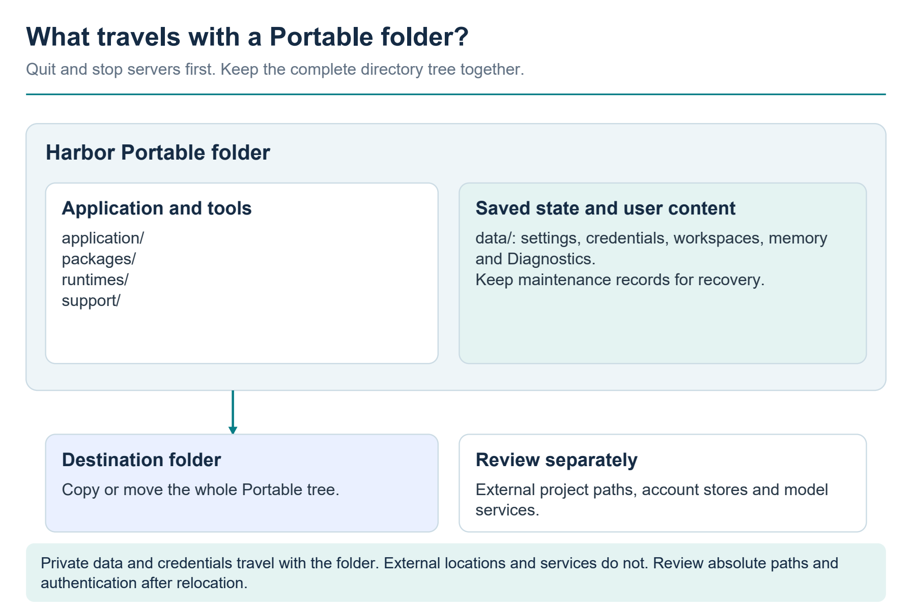

Use **Quit and stop servers** before transferring the complete folder. Its `data/` tree includes saved configuration, work and credential files, so an existing installation is private material. Review external project paths, machine-bound account access and the separately installed Hermes/model service at the destination. The relocation steps below cover those dependencies and exported client paths.

| Path relative to portable root | Purpose and handling |
|---|---|
| `application/current.json` | Pointer to the active packaged application. Let the launcher/maintenance flow manage it. |
| `application/releases/` | Packaged Harbor application. This installation retains one current application release. |
| `portable.json` | Portable format and platform marker; required for the portable profile. |
| `catalog.json` | Seed configurations used when `data/servers.json` does not exist; not a substitute for the user's saved configuration. |
| `maintenance.json` | Maintained component recipes, repositories, verification steps, and retention policy. |
| `runtimes/` | Bundled executables, browsers, embedding models, and runtime licenses. Do not mix arbitrary runtime versions into a working bundle. |
| `packages/` | Installed MCP packages and source checkouts. `packages/harbor-source` is the source used by Harbor's own Rebuild operation. |
| `support/` | Portable launch, environment, authentication, build, and verification helpers. |
| `data/servers.json` | Saved child-server definitions, paths, environment settings, and startup selections. Treat as potentially sensitive. |
| `data/harbor-settings.json` | Listener, timeout, tool-delivery, and related saved preferences. |
| `data/workspace/` | Default task workspace; includes persistent `harbor.sqlite` for DBHub. User-owned content, not disposable build output. |
| `data/memory/` | Persistent MCP Memory state, including `memory.jsonl`. |
| `data/auth/` | Gateway and upstream credential files. Keep private. Harbor stores its key and enabled state in `data/auth/gateway.json`; GitHub uses `data/auth/gh`, hosted embedding keys use `data/auth/embeddings`, and Brave's configured key file is here. |
| `data/commander/`, `data/serena/`, `data/home/` | Child-tool state and portable home/configuration directories. |
| `data/diagnostics/` | Diagnostic campaign/results data and diagnostic support state. Temperature chart history itself is held in memory and resets on exit. |
| `data/logs/`, `data/cache/`, `data/temp/` | Logs, caches, and temporary files. They can contain sensitive upstream or task material; do not classify all contents as safe for publication. |
| `data/maintenance/` | Status, temporary staging, activation journal, and pending application-update metadata. Do not remove during an operation or interrupted activation. |
| `verification/`, `inventory.json` | Evidence/metadata supplied with this installation; their dates and coverage matter. |

Harbor maintenance replaces a component under `packages/` or stages a new application; it is designed to preserve the separate `data/` tree. However, child tools can write to user-selected paths outside that tree, under the Windows account's permissions. Preserving only Harbor's folder does not capture all project outputs.

#### Relocate or transfer to another machine

1. Complete active client work and maintenance. Use **Quit and stop servers** and wait for the owned servers to stop before moving files.
2. Move or copy the entire portable directory together, preserving `data/` and support files. Do not substitute a fresh seed `catalog.json` for saved `data/servers.json`.
3. Launch with **Start Harbor.vbs** or **Start Harbor.cmd** from the new location. `${HARBOR_ROOT}` tokens are resolved against that location at runtime.
4. Refresh stdio client configurations: their exported executable and bridge paths are absolute. HTTP clients on the same host can retain the URL if the saved port/path are unchanged; network clients may need the new host address.
5. Review user-configured absolute paths, Git/Serena project locations, external database files, browser or other host dependencies, and optional WSL distributions. `${HARBOR_ROOT}` only relocates values that use that token; it does not migrate external projects.
6. Sign in to GitHub on the destination account/machine and reconfigure any other machine-bound authentication. Copying GitHub CLI configuration is not proof that the destination can decrypt or use the original Windows credential-store entry.
7. Check server status and perform representative tasks again. Relocation should not be declared successful based only on an app window or port.

The portable runtime supplies a controlled child `PATH` and portable home/cache directories, but this is not an operating-system sandbox. The Filesystem wrapper currently enumerates accessible local drive roots; Desktop Commander and other host-access tools also operate with the current account's permissions. Review server scope when moving to a different machine.

### Uninstall and retirement


For a portable installation, first disconnect client entries and use **Quit and stop servers**. Verify no update or owned process is still active. Identify the exact portable directory and any shortcut that points to it. Move or preserve required user data and files created outside Harbor before deleting that confirmed installation directory. There is no dedicated portable uninstaller in the inspected payload.

Do not delete unrelated original source repositories, shared runtimes, external model servers, account stores, WSL distributions, or other projects merely because Harbor used them. Removing a Harbor folder does not revoke a GitHub account token or remove hosted service accounts. Only perform account logout or credential revocation when that is intended. If a standard NSIS installation was used, use its Windows uninstall entry and separately inspect user-data handling; verify which user-data directories you want to retain; do not assume uninstall removes or preserves every child tool's files.

## 4. Desktop workflows

### Main-window reference


| Tab | What it shows | Available actions |
| --- | --- | --- |
| **This Server** | Active endpoint, bind address, available network URLs, current delivery mode, client configuration examples, gateway access controls and settings. | Set **Use API key** and **Loopback only**, generate/copy the gateway key and **Apply protections**; copy an endpoint/configuration. Change the port, MCP path, timeouts, bind address and allowed browser origins with **Apply settings**. The Tool Delivery shortcut opens that tab. |
| **Children Servers Statuses** | Running/starting/stopped/error state; discovered tool count; server ID; runtime and transport; known process IDs; managed versus external ownership. | Search; **Add server**; **Import config**; per-entry **Start**, **Stop**, **Restart**, **Configure** and **Remove**, as applicable to current state. |
| **Tool Delivery** | The active delivery interface, mode explanations and editable search/provider configuration. | Choose a mode, hybrid members, search limit, semantic model/relevance, provider details and credentials; **Apply tool delivery**. |
| **Diagnostics** | Live system gauges, temperature history, Hermes connection state, campaign controls, comparison tables and recent trials. | Inspect hardware; choose chart history/sensors; **Check Hermes**, **Start campaign**, **Cancel campaign**, **Copy results JSON**; switch the four comparison views. |
| **Advisor** | Task-specific, explainable server recommendations beside actual status and saved automatic-start/restart flags. | Choose category/internet preference; persist startup checkboxes or **Use recommended selection**; **Start selected**, **Keep selected running**, per-entry **Configure**. |
| **Tools** | The current upstream tool catalog, with namespaced names, descriptions and server IDs. | Search, filter by server, inspect a tool's input schema, **Copy schema**. This inspector does not execute a tool. |
| **Activity** | Harbor lifecycle, warnings, errors and diagnostics messages, newest first. | Search and filter by log level. The display is a bounded in-memory log, not a durable audit archive. |
| **Connections** | The active endpoint and local/LAN client configuration examples, plus initialized MCP client sessions. | **Copy endpoint**, choose the configuration address, switch **Streamable HTTP**/**Stdio bridge**, **Copy configuration**. |
| **Maintenance** | Current maintenance state, available component build recipes, component repositories and the build log. | **Enter maintenance mode**, component **Update and build** or **Rebuild**, and **Resume servers**. A restore control is only shown when the recipe reports a previous version is available. |

The ordinary desktop snapshot refreshes about every 1.5 seconds. Status counts describe discovered connections/tools at that moment. **Running** means the MCP connection initialized and discovery succeeded; it does not prove a remote account, plugin, project, permission or individual business operation is ready. The Tools tab shows the catalog behind Harbor; a search delivery mode advertises a smaller discovery interface to the model.

### Gateway access and API keys


In **This Server > Gateway access**, **Use API key** and **Loopback only** are placed together and are independently optional. Both are enabled for a new desktop installation. On the first desktop launch without an existing authentication store, Harbor creates an enabled key. A deliberately saved disabled choice stays disabled across restarts; a restart does not silently restore the default. Standalone core/CLI use does not inherit this desktop initialization: authentication remains optional and is off when no authentication service is supplied.

| Use API key | Loopback only | Result |
| --- | --- | --- |
| On | On | Only clients on this computer can connect, and they must supply the saved key. This is the new-install default. |
| On | Off | Clients reaching the configured network bind must supply the key. |
| Off | On | Clients on this computer can connect without a gateway key. |
| Off | Off | Clients reaching the configured network bind can use the gateway without a key. This is an allowed explicit choice. |

**Loopback only** limits the listener to this computer. Turning it off permits the configured network bind; it does not create a firewall rule, router mapping or public address. The saved bind address remains under **Gateway settings**. Network reachability and key authentication are separate decisions.

To configure or rotate access:

1. Open **This Server** and review the active **Use API key** and **Loopback only** states.
2. Leave the masked **Gateway API key** field blank to keep the saved key. To replace it, enter the intended key or select **Generate new key**. Generation creates a draft only; it does not rotate the active key or disconnect clients yet.
3. Select **Apply protections** to save both access choices and any replacement key together in one operation. Either or both controls can be turned off without a separate acknowledgement. Use **Apply settings** separately for ordinary endpoint/timeouts/bind changes.
4. Select **Copy key** if the client needs a separately entered key, or use **Copy configuration** for the selected connection format. **Copy key always copies the saved key**, not an unapplied generated draft. Apply a replacement before copying it.
5. Refresh the client configuration and reconnect after rotation or enabling/disabling authentication. These authentication changes close public MCP sessions, including external sessions on the raw-catalog route, while preserving child-server processes and their PIDs.

When authentication is enabled, an HTTP client sends `Authorization: Bearer <saved key>`. A missing or invalid key produces HTTP **401**. The bundled stdio bridge accepts the key through `HARBOR_API_KEY` or a key-only file selected by `HARBOR_API_KEY_FILE`; that file contains the key text, not Harbor's authentication-store JSON. Prefer the generated client configuration for the current release and adapt its wrapper only as required by the client.

The saved secret is hidden from ordinary snapshots and connection previews. Explicit **Copy key** and **Copy configuration** actions can place the actual saved key on the clipboard, so treat the copied configuration as a credential. The gateway key is stored separately in Portable `data/auth/gateway.json` (or the nonportable profile's `auth/gateway.json`) as plaintext. Harbor requests file mode `0600` where the filesystem honors it; this is not an encrypted credential vault. Copying the Portable folder copies that key. Keep it out of public archives, screenshots and support logs.

One shared gateway key controls access; it does not give different clients separate tool permissions or separate upstream state. It also does not enable TLS. Network HTTP carries the key and tool traffic without transport encryption. Host/Origin checks remain separate checks and are not substitutes for the key. Disabling the key is supported, but then any client that can reach the selected listener can invoke its exposed tools.

### Working with child servers


#### Add, configure and import

**Add server** opens a form for a stable ID and display name. IDs use letters, numbers, hyphens and underscores. Choose **Standard I/O (stdio)**, **Streamable HTTP** or **Server-sent events (SSE)**. Stdio launches may use a native runtime or WSL. WSL arguments, commands and directories use Linux paths; the optional distribution field selects a WSL distribution.

For stdio, put only the executable in **Command** and supply **Arguments** as a JSON array. This is not a shell command field: shell pipelines, redirection and chained commands are not interpreted as shell syntax. The working directory is optional, and **Environment** accepts a JSON object of string values. Stored environment values are plain text in the local server configuration. Keep configurations containing credentials out of screenshots, support bundles and public GitHub commits.

The Serena and Git templates fill the form using the selected repository path. **Apply template** does not install dependencies, download anything or start a server. Review the resulting fields and save them.

For HTTP/SSE, supply the full endpoint URL. Custom authentication headers are not supported by this editor. A blank **Managed processes** array means the service is externally managed; Start/Stop/Restart control Harbor's connection only. A nonempty array gives Harbor ownership of its listed foreground processes. Each process can specify a command, argument array, directory, environment, native/WSL runtime and optional WSL distribution. WSL supervision requires Python 3 inside that distribution. Avoid detached launchers: Harbor must be able to supervise the foreground process. Stop an existing external service before transferring its port to Harbor ownership.

Saving a new entry does not start it immediately. Saving an existing entry's full configuration stops that entry, even if only a management flag changed; use its Start control afterward. Selecting **Start automatically when Harbor opens** or **Restart automatically after a failure** persists those choices. Removing an entry stops its owned activity and removes its saved configuration; it is not an uninstall operation for its software or project data.

**Import config** accepts a JSON file or pasted common `mcpServers` configuration. Review every launch before importing. An existing ID is rejected rather than overwritten. Imported entries remain stopped until explicitly started. A successful import is not proof that the referenced program, repository, runtime or credential exists.

#### Lifecycle and recovery

Startup progresses from **Stopped** to **Starting**, then **Running** after MCP initialization and fresh tool discovery. Failure yields **Error** and a diagnostic message. A server that intentionally exposes no tools may have a zero tool count without being broken. Unavailable entries are removed from the advertised tool catalog.

Automatic restart is conditional on a server still being desired and its saved autorestart option. Retry delays grow from roughly half a second to a maximum of 30 seconds. A successful run lasting more than 30 seconds resets that failure backoff. An explicit Stop cancels pending startup/retry work for that entry. Full editor saves are serialized with configuration writes; lifecycle actions are serialized per entry rather than as one all-server transaction.

Harbor-managed HTTP/SSE services are different from external ones. Harbor attempts bounded MCP reconnection after a transport fault while retaining its owned process tree when recovery succeeds. If reconnection fails, its supervisor follows the configured stop/restart lifecycle. A connection closing is not permission to terminate an unrelated listener. Ownership records in the status card identify which processes Harbor launched.

### Advisor and saved startup choices


Advisor is an offline rules panel. It uses the configured server IDs and runtime snapshots; it does not call an AI service, search the internet, install anything or execute tools to produce recommendations. Unrecognized custom server IDs are labeled optional with unknown capability/network assumptions.

Choose **Research**, **Coding**, **Files / documents**, **Browser testing**, **Debugging**, **Planning** or **Offline / local**. Recommendations consider the task, the internet preference, current selections and overlapping coverage from running servers. Categories change the recommendation, not the server configuration. **Internet available for this task** is a preference, not a network probe or firewall. Turning it off does not stop existing services.

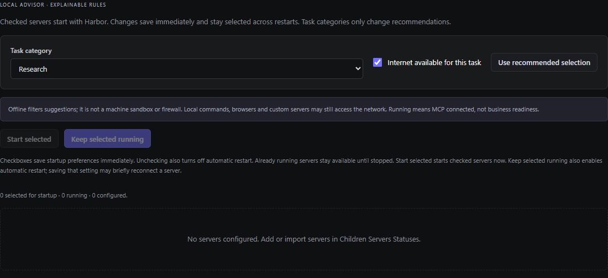

Choose the task category and internet preference, then review recommendations for your configured child servers. This fresh profile has no child entries to select. Add or import servers first; Advisor does not install a toolbox when a category is selected.

**The checklist is persistent.** Checking an entry saves `autoStart: true` immediately. Unchecking saves `autoStart: false` and `autoRestart: false`; the currently running process is left available until explicitly stopped. **Use recommended selection** replaces the saved startup selection with the current recommended set and therefore also disables automatic restart for entries it unchecks. It does not start or stop those processes immediately. Inspect the displayed saved flags to confirm the result.

| Action | Immediate effect | Persistent effect |
| --- | --- | --- |
| Check one entry | Saves the preference; no immediate start/restart. | Starts with Harbor next time. Existing autorestart flag is preserved. |
| Uncheck one entry | Saves the preference; leaves a running process available. | Automatic startup and automatic restart are both off. |
| Use recommended selection | Saves the current recommendation as the startup selection. | Replaces the saved startup checklist; unchecked entries also lose autorestart. |
| Start selected | Starts selected, eligible entries whose freshly read state is stopped. Running, starting and error entries are left alone. | The action itself does not change automatic flags; the checklist has already been saved. |
| Keep selected running | Enables both automatic flags when needed, then starts eligible stopped entries and verifies their state. | Autostart and autorestart are on. A full save can briefly disconnect an already-running entry. |

The batch reports a result per server and continues after an individual failure. It checks fresh snapshots before and after changes and skips an entry whose launch changed or disappeared during the action. Failed starts can leave the requested persistent flags saved; the panel shows that actual outcome. Use individual Start/Restart controls to retry an Error after addressing its cause.

Known credential-dependent entries are initially **Needs setup**. Configure them and start them individually. An observed running connection supplies only session-specific evidence for the same launch configuration. For example, a running design connector does not establish an active design/plugin session, and a running IDE connector does not establish an IDE bridge. Broad host tools such as Desktop Commander can run commands and access files; **local** does not mean read-only or sandboxed.

## 5. Connections and endpoints

### Connect an MCP client


Start Harbor with **Start Harbor.cmd**, **Start Harbor.vbs**, or the installed shortcut. Keep Harbor running while a client uses its tools. Open **Children Servers Statuses** and start the child servers needed for the task, then open **This Server** or **Connections**. The **Active connection** card shows the current endpoint and active delivery mode. The default endpoint is:

```text
http://127.0.0.1:37373/mcp
```

Harbor provides a **Streamable HTTP MCP tools gateway**. It is not a model inference server, an OpenAI-compatible chat endpoint, or a browser dashboard served at that URL. The desktop controls use local Electron IPC. MCP prompts and resources are not proxied. Child-server tool names are namespaced to avoid collisions; use the exact name advertised by Harbor rather than constructing it yourself.

#### A client on the same computer: Streamable HTTP

1. In **Client configurations**, choose **Local** as the configuration address.
2. Select **Streamable HTTP** and choose **Copy configuration**.
3. Merge the `harbor` entry into the client's existing MCP configuration. Do not replace unrelated entries. With **Use API key** enabled, the common-format configuration is:

```json
{
  "mcpServers": {
    "harbor": {
      "url": "http://127.0.0.1:37373/mcp",
      "headers": {
        "Authorization": "Bearer <YOUR_HARBOR_API_KEY>"
      }
    }
  }
}
```

4. When entering this example manually, replace `<YOUR_HARBOR_API_KEY>` with Harbor's saved gateway key. The real **Copy configuration** action includes the saved key in the clipboard when authentication is enabled; the on-screen preview intentionally shows a placeholder. Keep pasted client configuration and clipboard contents private. When authentication is disabled, Harbor's copied configuration omits the `headers` entry.
5. Reconnect or restart the client's MCP connection. Its exact configuration wrapper may differ from `mcpServers`; if it offers a server form, select Streamable HTTP, enter the copied URL, and set the Authorization header to `Bearer ` followed by the saved key when required.
6. Confirm that the client appears under **Connections → Connected apps**. Confirm discovery by inspecting the client's tools and asking for a small, appropriate read-only operation. In a search mode, seeing discovery/invocation tools instead of hundreds of individual tools is expected.

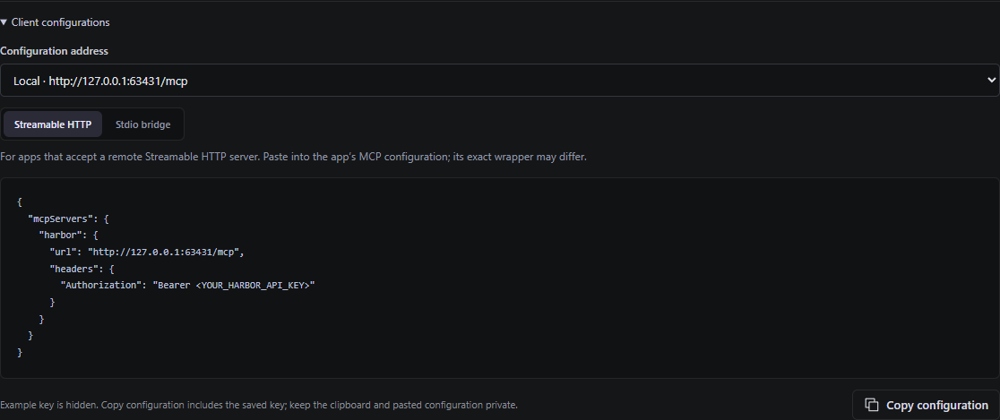

Choose the configuration address and transport, then use **Copy configuration** for the client. The capture uses a separate listener port; use the address shown by your own running instance. The preview masks the saved gateway key with a placeholder; copying includes the credential when authentication is enabled. After connecting, check **Connected apps** for the client's initialized session.

The UI's **Tools** tab displays the underlying running-server catalog and input schemas. Opening a tool inspector does not execute it. This catalog can be larger than the list initially advertised to a client using a search mode.

#### LM Studio

LM Studio's official documentation supports `mcpServers` entries containing a remote `url` and an optional `headers.Authorization` bearer value. Open its **Program** sidebar, choose **Install → Edit mcp.json**, and merge the `harbor` entry shown above into the existing `mcpServers` object. Replace the placeholder with the saved **Harbor gateway key**, or use Harbor's **Copy configuration** action after enabling authentication. Do not use the Brave provider key or an embedding-service key here. Save and reconnect the MCP integration, then confirm Harbor appears among the available tools. [LM Studio: Use MCP Servers](https://lmstudio.ai/docs/app/mcp)

#### A client that only supports stdio

Select **Stdio bridge** in Harbor's **Client configurations**, then copy that configuration. The generated command uses the bundled `runtimes/node/node.exe` in Portable and the active release's `resources/bridge.mjs`. The bridge forwards JSON-RPC over HTTP to the existing Harbor gateway. It does not launch another copy of every child server.

For illustration, if Node and a copied standalone bridge are on the client computer at the following paths, this is the equivalent configuration:

```json
{
  "mcpServers": {
    "harbor": {
      "command": "C:/HarborClient/node.exe",
      "args": [
        "C:/HarborClient/bridge.mjs",
        "http://127.0.0.1:37373/mcp"
      ],
      "env": {
        "HARBOR_API_KEY": "<YOUR_HARBOR_API_KEY>"
      }
    }
  }
}
```

Replace the illustrative paths with real client-side files, or use Harbor's generated paths directly when the client is on the Harbor computer. Replace the key placeholder when authentication is enabled; omit the `env` block when it is disabled. A separately copied bridge requires **Node.js 20 or later** and no npm dependencies. Its endpoint argument is optional; the default is the local URL above.

The new bridge reads `HARBOR_API_KEY` and sends it as `Authorization: Bearer <key>`. Alternatively, set `HARBOR_API_KEY_FILE` to a client-side text file containing only the key. A nonempty `HARBOR_API_KEY` takes precedence over the file; file contents are trimmed. Do not point `HARBOR_API_KEY_FILE` at Harbor's `gateway.json`, which is a JSON state document rather than a plain key file. The bridge reads its credential when it starts, so restart the client/bridge after changing or rotating a key. HTTP and HTTPS endpoints are supported by the bridge, but Harbor's own listener remains HTTP. Each request has a five-minute bridge timeout; increasing Harbor's tool timeout above that will not extend this bridge limit.

Portable relocation changes local executable and bridge paths. Application updates can also change the active release's bridge path. Regenerate the stdio snippet after either change if it points into the application release directory. An HTTP client only needs updating if its host, port, or MCP path changes.

#### A client on another computer

`127.0.0.1` means the computer running the client. It does not reach another machine's Harbor.

1. Open **This Server → Gateway access**. Keep **Use API key** enabled if connections should require the saved key; disabling it is also supported.
2. Clear **Loopback only** and select **Apply protections**. This allows network binding using the saved bind address; its default is `0.0.0.0` (all IPv4 interfaces). It does not change the **Use API key** selection.
3. If a specific interface is desired, use **Gateway settings → Bind address** after loopback-only mode is off. Choose a literal address belonging to this machine and select **Apply settings**. `0.0.0.0` listens on all IPv4 interfaces; `::` is the IPv6 wildcard. An address change can require clients to update their URL.
4. Read the displayed network status. Both switches can be disabled together, which allows reachable devices to invoke tools without a key. A key requirement does not create encrypted transport.
5. Under **Active connection**, copy an advertised LAN endpoint. In **Client configurations**, select that LAN address before copying the client configuration.
6. Configure the other computer to use that address. If using the stdio bridge, Node and `bridge.mjs` must exist on that other computer; the Windows paths exported by the Harbor computer are not automatically valid there.
7. Verify the network route and Windows firewall permissions if the connection fails. Harbor does not open firewall rules, configure a router, create a tunnel, or provide a public address.

For example, if Harbor advertises `http://192.168.1.50:37373/mcp`, use that exact URL instead of loopback. Do not use `0.0.0.0` as a client destination. Prefer an advertised IP address over an unconfigured DNS alias: Harbor checks the HTTP `Host` header against its expected addresses and hostname.

The gateway uses one shared API key when its authentication option is enabled. It has no per-client roles, individual user accounts or built-in TLS listener. **HTTP does not encrypt the key or tool traffic.** Use network access only within the intended trusted boundary; anyone able to observe unencrypted traffic may learn its bearer credential. With authentication disabled, any reachable process/device can invoke available tools. Loopback remains the default and is appropriate when all clients are local. A separately configured HTTPS proxy/tunnel is separate infrastructure whose full behavior is not verified by this chapter.

All clients share one upstream instance and its mutable state for each server entry. Separate client connections are not separate workspaces. Use distinct server entries, IDs, and server-specific project/data locations where isolation is required; two entries pointing at the same writable data directory still share that data.

### Endpoint reference


| Address or route | Purpose and behavior |
| --- | --- |
| `http://127.0.0.1:37373/mcp` | Default client-facing Streamable HTTP MCP endpoint. Actual host, port, and path are displayed in the app. Supports session initialization, tool discovery/invocation, notifications and session closure through the MCP transport. |
| Advertised LAN endpoint | Same MCP tools protocol and gateway authentication state. Reachability still depends on the bind/interface and network. |
| `<MCP endpoint>/_harbor_catalog` | Full-catalog MCP route used by delivery workers. External clients are subject to the gateway key requirement when enabled. Harbor's own workers use a separate process-scoped internal token accepted only on this catalog route. The route advertises raw tools and permits invocation regardless of selected search mode; search modes are not permission controls. Ordinary clients should use the main endpoint. |
| `/`, `/health`, `/api/...`, `/v1/chat/completions` | No such public Harbor gateway routes are implemented. A 404 at an unrelated path is not evidence the MCP endpoint failed. |

The gateway uses MCP sessions: a plain browser GET without initialization is not an MCP connection test and can return a missing-session error. Use an MCP client for acceptance. Changing the listener address, port or path replaces the gateway and requires clients to reconnect. Delivery changes send tool-list change notifications, but reconnecting is advisable for clients that cache tools. Child-server processes stay running during ordinary gateway settings changes.

HTTP request bodies have a 1 MiB limit. The gateway only accepts its exact configured path and exact internal catalog path; extra query strings or trailing slashes change the route. Invalid or unknown MCP sessions require a new initialization.

#### Browser origins and CORS

The **Allowed origins (JSON array)** setting is for browser-based clients. Native MCP clients usually send no Origin header and do not need an entry. Harbor accepts its own exact HTTP origins; an additional browser application requires its exact origin, for example:

```json
["http://localhost:5173"]
```

This example permits a browser application actually hosted on that origin; it does not configure or start such an application. Origins must use HTTP or HTTPS and contain no credentials, path, wildcard, query or fragment. Host validation still applies independently. An empty array rejects arbitrary browser origins, but **CORS is separate from API-key authentication**. Supported preflight methods are GET, POST and DELETE. Allowed request headers include `authorization`, `accept`, `content-type`, `mcp-session-id`, `mcp-protocol-version`, and `last-event-id`. An allowed preflight does not authorize tool calls; actual MCP requests still require the saved bearer key when enabled. Native LM Studio/stdio configurations do not depend on browser CORS.

## 6. Configuration reference

### Gateway access and saved key


This is the **Harbor gateway credential**, used by LM Studio or another client connecting to Harbor. It does not authenticate Harbor to Brave Search, GitHub, OpenAI embeddings, Cloudflare, or any other upstream service.

On first desktop setup, Harbor creates the gateway authentication store, generates and saves a key, and enables **Use API key**. **Loopback only** also starts enabled. The two switches sit together in **This Server → Gateway access** and are independent. A choice explicitly saved as disabled stays disabled across later launches; the initial defaults do not override it. Upgrading an older desktop profile with no gateway authentication file also creates the first saved key; update and reconnect its client configurations. An existing valid authentication file is retained.

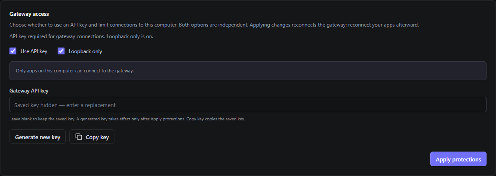

Review both switches, then select **Apply protections** to save changes. A blank **Gateway API key** field keeps the saved key; it does not mean no key exists. **Generate new key** fills a draft that must be applied before it becomes active.

| Use API key | Loopback only | Result |
| --- | --- | --- |
| On | On | Apps on this computer can connect using the saved bearer key. This is the first-setup default. |
| Off | On | Apps on this computer can connect without a key. |
| On | Off | Devices that can reach the selected bind address can connect using the saved bearer key. |
| Off | Off | Devices that can reach the selected bind address can connect without a key. |

All four final combinations are supported. Change either or both switches and select **Apply protections** to save both choices. Turning off the key does not turn off loopback, and turning off loopback does not turn off the key.

**Known transition issue, confirmed September 19, 2026:** starting with network access and a required API key, changing both switches to key off and loopback on can briefly leave the previous network listener unauthenticated while settings work is pending. The default loopback-only state is not remotely exposed by this finding. A fix and retest are pending; no workaround has been verified. See Release verification for the audit scope.

To view, replace or rotate the initial saved key:

1. Open **This Server → Gateway access**.
2. Enter a key in **Gateway API key**, or select **Generate new key**. The generator creates a `harbor_` token from 32 random bytes. Generation fills the draft field only; it does not replace the active saved key yet.
3. Set **Use API key** and **Loopback only** to the desired independent choices. Leave both enabled for the first-setup configuration.
4. Choose **Apply protections**. A successful save clears the visible key field. Leaving that field blank on a later Apply keeps the existing saved key.
5. Choose **Copy key** to copy the **saved** key, or use **Client configurations → Copy configuration** to copy the current endpoint and saved credential together.
6. Update and reconnect every client. Applying authentication changes disconnects public/client-created sessions, including external sessions on the catalog route. Child-server processes keep running; clients need a fresh MCP connection.

**Copy key** never copies an unsaved generated replacement. Apply first if the intention is to use that new key. It remains available for a saved key even while authentication is disabled. The UI does not display the stored secret as plain text or include it in ordinary connection previews. Explicit clipboard actions contain real credentials, so keep clipboard history and pasted client files private. The **Copy endpoint** action copies only the URL, not a key.

User-entered keys must contain 16–4096 characters: letters, digits and the supported token characters `- . _ ~ + /`, with optional `=` padding at the end; spaces/newlines are not allowed. The UI trims surrounding whitespace before submission. Using **Generate new key** avoids formatting mistakes.

The first-setup defaults above describe the desktop application. The standalone stdio bridge is a client: it does not create or enable a server-side key. Supply the current key through its environment or key file when the server requires one. Programmatic test hubs can be constructed without an authentication provider; that fixture behavior is not the desktop first-launch default.

#### Storage, disabling and rotation

Portable stores gateway authentication in `data/auth/gateway.json`, separately from `data/harbor-settings.json` and child-server configuration. Its schema is:

```json
{
  "version": 1,
  "enabled": true,
  "key": "harbor_placeholder_not_a_real_key"
}
```

This example is a placeholder, not a suggested production secret. The real file contains the saved key in plaintext; it is not encrypted or stored only as a hash. The code uses a temporary file and rename when saving and requests owner-only mode `0600` where the operating system honors it. This is not an encrypted Windows credential vault or a claim of a specially configured Windows ACL. Portable copies include this file unless deliberately excluded. Do not publish it, include it in screenshots, or point the public source exporter at the live `data` tree. Ordinary authentication status exposes only `enabled` and `hasKey`; the secret is excluded from general snapshots, logs and previews.

To rotate the key, enter or generate a replacement, keep **Use API key** selected, and choose **Apply protections**. Then use **Copy configuration** and reconnect each client. The old key stops authenticating new requests, and public/client-created sessions are disconnected. There is one current shared key, with no configured overlap/expiry/grace-period field. Harbor's own catalog workers use their separate internal credential so normal delivery can continue without restarting child servers. Finish important client operations before rotating: disconnecting a session does not undo tool actions already performed.

To disable the key requirement, clear **Use API key** and select **Apply protections**. This retains the saved key for reuse; it does not delete the key file, change **Loopback only**, or revoke an upstream provider credential. When key use is disabled, copied client configurations omit authentication headers/environment entries. To permit network connections, separately clear **Loopback only** and Apply. Either disabled choice persists after restart, including when both are disabled. The local desktop control remains the normal recovery path for a client with an old or lost key.

If an existing auth file is malformed, has an invalid schema/key, or says enabled without a saved key, startup fails rather than silently accepting it as disabled. With Harbor stopped, correct the file using a valid key/schema and the intended enabled state, then restart and reconnect clients. On a desktop launch where the auth store is missing, first-setup initialization creates and saves a new enabled key; existing client keys would then need updating. Do not delete the auth file as a routine reset. An existing valid disabled state is preserved rather than treated as missing.

#### On-wire behavior

With **Use API key** enabled, clients must send `Authorization: Bearer <key>` with MCP requests. A missing or incorrect key receives HTTP **401**. The Bearer scheme is matched case-insensitively; the key itself remains case-sensitive. Its parser expects one space after Bearer and does not implement query-string keys, a custom `X-API-Key` header, HTTP Basic authentication or an OAuth login flow. Do not put keys in endpoint URLs or command-line arguments. An MCP session ID is not a substitute for authentication on later requests.

Harbor supplies a separate internal catalog token to its delivery worker through the worker process environment. That token is scoped to the catalog route; it does not authorize the public MCP route and is not the value users copy into LM Studio. Users should neither set nor distribute it. Ordinary external catalog clients follow the same saved-key policy as ordinary gateway clients.

### Gateway settings and persistence


Use the two switches in **This Server → Gateway access** for key use and loopback restriction, applying them with **Apply protections**. Use **Gateway settings** for the port, path, bind address, timeouts and origins; those draft values are not active until **Apply settings** succeeds. An error preserves the form draft; correct it and retry. Port, path and bind changes reconnect clients; timeout changes do not restart child processes.

| Saved field | UI name | Default and accepted values |
| --- | --- | --- |
| `port` | Port | `37373`; integer 1–65535. |
| `mcpPath` | MCP path | `/mcp`; one absolute URL path, outside `/api`, without query, fragment, spaces, backslashes or dot segments. |
| `networkEnabled` | Loopback only (inverse) | Default `false` means **Loopback only** is on. Checking the switch saves `networkEnabled: false` and binds to `127.0.0.1`; clearing it saves `true` and uses the saved bind address. |
| `bindAddress` | Bind address | `0.0.0.0`; literal local IPv4/IPv6 address or wildcard, not a URL or DNS name. Used and editable when **Loopback only** is off. |
| `requestTimeoutMs` | Initialization / discovery timeout (seconds) | `60000` ms / 60 seconds. Saved range 1000–3600000 ms. Also governs managed-server startup. |
| `toolTimeoutMs` | Tool timeout (seconds) | `120000` ms / 120 seconds. Saved range 1000–3600000 ms. A client may impose a shorter timeout. |
| `allowedOrigins` | Allowed origins (JSON array) | `[]`; exact HTTP(S) origins. |

Portable saves the gateway and delivery settings together in `data/harbor-settings.json`, and child entries in `data/servers.json`. **This Server** and **Connections** show the actual paths; use those paths for nonportable installations rather than guessing the profile directory. Prefer the UI. If offline editing is necessary, quit using the tray's **Quit and stop servers** first. Closing the window only hides it and is not sufficient. Supply valid JSON, preserve unrelated settings, and restart Harbor. Invalid saved JSON/settings cause an explicit startup failure instead of silently replacing the file with defaults.

Existing saved choices are retained. A new settings file defaults to **All tools with 5 results per search method**; your installation may use different saved choices.

### Add or import a child server


Open **Children Servers Statuses → Add server**. Give the entry a unique stable ID containing 1–40 letters, digits, `_` or `-`, and a readable name. IDs are the namespace boundary and cannot collide. Choose one of these supported transports:

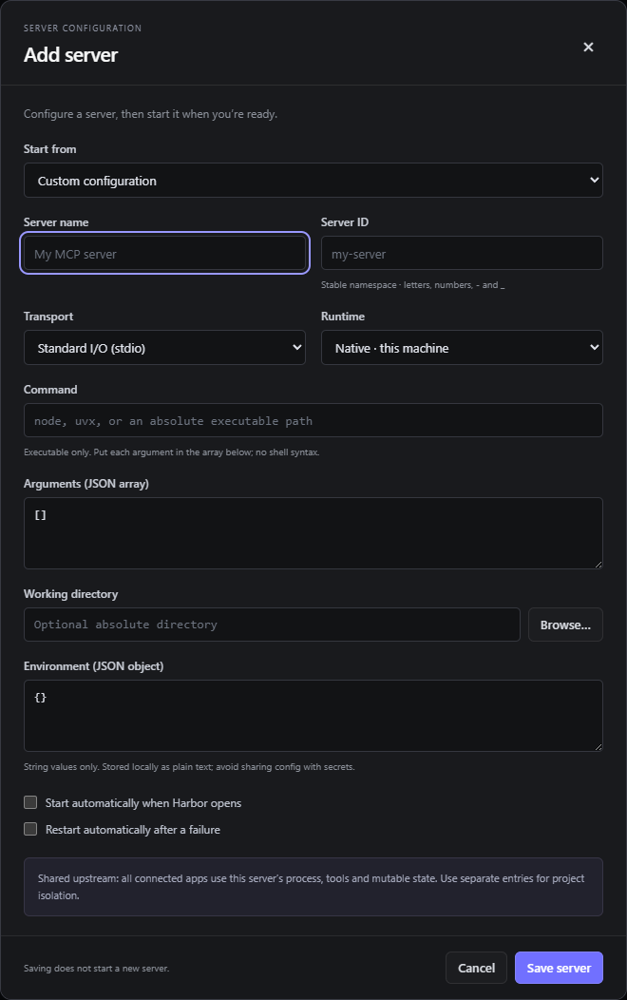

Fill in the server identity, transport and launch or connection fields, then choose **Save server**. The blank form creates no server by itself. After saving a new entry, use its **Start** control and inspect the resulting status.

| Transport | Configuration and ownership |
| --- | --- |
| Standard I/O (stdio) | Command, JSON array of arguments, optional working directory, Environment JSON, Native or WSL runtime. Harbor owns the child and connects through stdin/stdout. |
| Streamable HTTP | Full HTTP(S) MCP URL. With `managedProcesses: []`, Harbor connects to an externally managed service and does not own its process. |
| SSE | Full HTTP(S) legacy SSE MCP endpoint. This is an upstream compatibility option, not Harbor's client-facing transport. Ownership follows the same managed/external rule as HTTP. |

The **Command** field is an executable only. Put each argument in a separate JSON string; shell operators, inline `cd`, pipes, and shell assignments do not belong there. Forward slashes work well in Windows JSON paths. Environment values must be strings. Environment JSON is stored as plaintext, so do not share a configuration containing secrets.

**Save server** does not start a newly added server. Saving an existing entry stops that entry's current connection/process while replacing its configuration; start it afterward. **Start automatically when Harbor opens** controls the next application launch. **Restart automatically after a failure** controls recovery after an unexpected failure, not an intentional Stop. The startup-selection control also clears auto-restart when disabling an entry; an explicit later edit can choose a different combination.

**Import config** accepts a common `mcpServers` object. Imported entries are forced to `autoStart: false` and `autoRestart: false`; review them and start the required entries deliberately. Existing IDs are never overwritten by import. Rename a conflicting incoming ID. Import only installs configuration—it does not install referenced packages or executables.

Example for an already-installed native server (replace illustrative paths before use):

```json
{
  "mcpServers": {
    "project-helper": {
      "name": "Project helper",
      "transport": "stdio",
      "runtime": "native",
      "command": "${HARBOR_ROOT}/runtimes/node/node.exe",
      "args": ["C:/MyTools/project-helper/server.mjs"],
      "cwd": "C:/Projects/Example",
      "env": {},
      "autoStart": false,
      "autoRestart": false
    }
  }
}
```

Example for an **already-running** local HTTP MCP service:

```json
{
  "mcpServers": {
    "local-service": {
      "name": "Local service",
      "transport": "http",
      "url": "http://127.0.0.1:9000/mcp",
      "managedProcesses": [],
      "autoStart": false,
      "autoRestart": false
    }
  }
}
```

The example address is illustrative; Harbor does not create a service on port 9000. For an external entry, Start/Stop/Restart affect Harbor's MCP connection only. To let Harbor launch an HTTP/SSE service, supply a nonempty **Managed processes (JSON array)**. Each process specification supports `command`, string `args`, string `env`, optional `cwd`, `runtime`, and optional WSL `distro`. Run foreground processes rather than detached launchers. Stop a separately running service before transferring ownership: Harbor refuses to adopt a pre-existing listener as its own.

For WSL, select **WSL**, give the Linux command/path, Linux working directory, and optional distribution. WSL must already be installed and configured; managed WSL launch support requires Python 3 there. Use `runtime: "wsl"` rather than embedding `wsl.exe` in a Native managed specification. Portable Windows runtimes are not a substitute for Linux prerequisites.

Harbor's upstream HTTP/SSE clients do **not** implement custom headers, bearer-token configuration or an OAuth sign-in flow. This upstream limitation is distinct from clients supplying a bearer key to Harbor's new incoming gateway. An upstream URL cannot contain username/password credentials. Adding a `headers` or `auth` object to an imported child-server entry does not enable authentication: those are not supported child fields. Use an upstream's supported stdio wrapper where available, or independently provide and verify the required authenticated integration. Configuring Harbor's incoming key does not configure a provider's credential.

#### Config schema and portable path expansion

On disk, `data/servers.json` has this outer structure:

```json
{
  "version": 1,
  "servers": []
}
```

The array contains server records including their `id`; the Import dialog uses a different outer `mcpServers` object keyed by ID. Do not paste the import wrapper over `servers.json`.

`${HARBOR_ROOT}` is a literal token that Harbor expands in portable launch configurations, including nested strings. It is not a shell variable to expand while writing JSON, and arbitrary `${NAME}` substitution is not implemented. Use it for bundled executable, argument, environment-value, and working-directory paths. Child launch uses bundled Node, Git, Python, Typst and uv paths and portable home/cache/temp directories. Host-specific references outside the portable folder must still exist after moving the folder.

Advanced core configuration also supports `managedProcesses[].gracefulStop` for a native owned process: a command, string arguments, optional directory/environment, and `timeoutMs` between 1000 and 300000 (default 120000). **Current limitation:** the desktop form parser accepts a narrower set of managed-process fields and rejects this extension. The current editor cannot save this extension; use only the documented common fields through the UI. The common fields above work through the UI.

### Startup environment reference


| Name | Meaning and limitation |
| --- | --- |
| `HARBOR_PORTABLE_ROOT` | Selects a Portable root with a valid `portable.json`. Normal portable launch sets it. An explicitly invalid marker path fails instead of falling back to the installed profile. |
| `HARBOR_DATA_DIR` | Overrides Electron's data directory for a nonportable development/test launch. Ignored in Portable; the portable launcher clears inherited overrides. |
| `HARBOR_PORT` | Direct application launch override. Integers 0–65535; 0 requests an ephemeral port for tests. Saved UI settings accept 1–65535 only. The normal portable launcher clears this override, so change **This Server** for ordinary Portable operation. |
| `HARBOR_TOOL_RUNTIME_ROOT` | Development/test override locating Portable search-worker runtimes. Normal Portable search uses `HARBOR_PORTABLE_ROOT`; ordinary users need not set it. |
| `HARBOR_PORTKEY_PACKAGE` | Development/test override for the Portkey package used by the semantic worker. Not a provider credential. |
| `HARBOR_API_KEY` | New stdio bridge's bearer key; included by **Copy configuration** for stdio when incoming gateway authentication is enabled. Read at bridge startup, not a command that changes Harbor's saved auth state. |
| `HARBOR_API_KEY_FILE` | Alternative stdio bridge credential source: path to a plaintext client-side key file. Used only if `HARBOR_API_KEY` is empty/unset. Not the JSON `data/auth/gateway.json` file. |
| `BRAVE_API_KEY_FILE` | Installed Brave child's key-file path, set in that entry's Environment JSON. |
| `GH_CONFIG_DIR` | Set by Harbor's GitHub wrapper to Portable `data/auth/gh`. A caller's unrelated profile override is ignored by the wrapper. |

The desktop's saved incoming authentication is managed through **Gateway access** and its separate auth file. Setting `HARBOR_API_KEY` on a client configures that bridge's outgoing header; it does not enable, disable or rotate Harbor's stored key. Child/provider environment variables have their own meanings.

## 7. Tool delivery and credentials

### Choose tool delivery


Open **Tool Delivery**, select a mode, adjust the fields shown for that mode, then choose **Apply tool delivery**. Reconnect the model client afterward. Tool delivery controls discovery; it does not grant or restrict tool permissions, modify the model's weights, or guarantee correct tool use. Use Diagnostics to compare delivery choices on the actual harness and hardware.

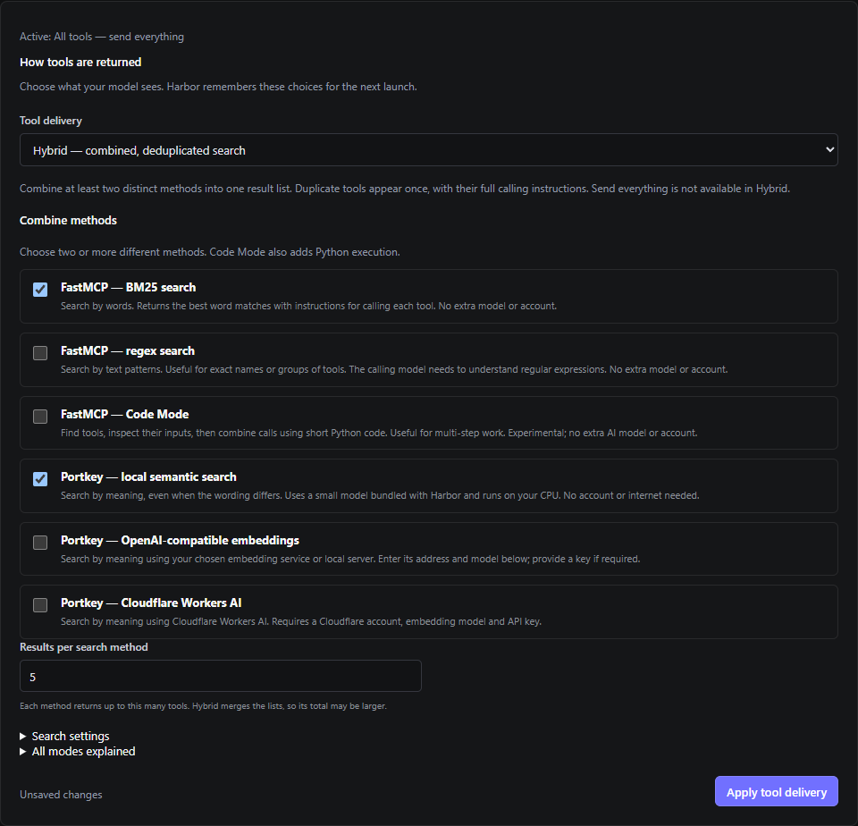

For Hybrid, select at least two search methods and review their settings before **Apply tool delivery**. This screenshot shows a draft selection; choosing it does not change the active gateway until Apply succeeds.

| UI mode / saved ID | Model-facing behavior | Dependencies |
| --- | --- | --- |
| All tools / `all` | Advertises every available tool definition immediately. | No search model. Large catalogs consume more client/model context. |
| FastMCP — BM25 search / `bm25` | Word-based ranked discovery plus invocation tools. | Bundled FastMCP/Python. No account or embedding model. |
| FastMCP — regex search / `regex` | Pattern-based discovery plus invocation tools. | Bundled FastMCP/Python; client must provide useful regular expressions. |
| FastMCP — Code Mode / `code` | Search, retrieve schemas, then compose existing calls with Python. | Bundled experimental FastMCP Code Mode/Monty. Not a general unrestricted Python shell. |
| Portkey — local semantic search / `portkey-local` | Meaning-based `search_tools`, then `call_tool` using a returned exact name and arguments. | Bundled CPU embedding model; no account or normal-search download. |
| Portkey — OpenAI-compatible embeddings / `portkey-api` | Semantic discovery through the specified embedding service. | Compatible embedding base URL, model, dimensions, and API credential or supported no-key local endpoint. |
| Portkey — Cloudflare Workers AI / `portkey-workers` | Semantic discovery through the account's embedding endpoint. | Cloudflare endpoint, `@cf/` model, dimensions and API key. |
| Hybrid / `hybrid` | Searches each selected method, merges and deduplicates exact namespaced tools, returns full schemas and matching methods. Code Mode adds schema/execution tools if included. | Two or more distinct methods from the six search/code modes. All tools and Hybrid cannot be members. |

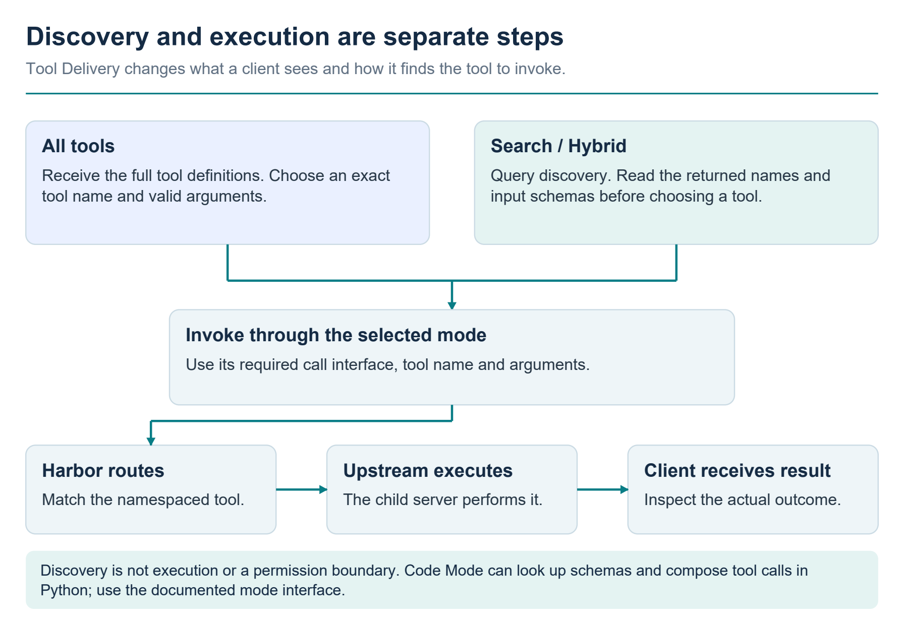

All tools exposes definitions immediately; search modes first return matching names and input schemas. The client still has to select and invoke the intended tool through the mode's interface. Discovery alone does not perform the requested task or establish a permission boundary. Code Mode adds schema lookup and Python composition of tool calls.

**Results per search method** accepts 1–50, and limits each method before Hybrid merges its results. Hybrid's final list can therefore be larger. Ranking combines method ranks, not uncalibrated scores from different engines. If one Hybrid method fails, successful methods can return results alongside warnings. If every method fails, search fails explicitly. Stopped servers disappear from the searchable catalog.

In **Search settings**, **Minimum relevance** accepts 0–1 (default 0.25) for semantic matches. Lower values admit more weak matches; higher values can exclude usable tools. The four **Local search model** choices are:

- `Xenova/all-MiniLM-L6-v2` — default.
- `Xenova/all-MiniLM-L12-v2`.
- `Xenova/bge-small-en-v1.5`.
- `Xenova/bge-base-en-v1.5`.

These are embedding models, not chat models. Initial indexing can take longer than subsequent queries; changing a model or catalog can require a new index. Installed assets are in `runtimes/embedding-models`. A missing selected model produces an error rather than a hidden download during search.

The relevant saved delivery fields are `toolMode`, `hybridModes`, `searchLimit`, `semanticMinScore`, `portkeyLocalModel`, and the provider settings described below. Even outside Hybrid, keep the saved `hybridModes` list valid; validation requires at least two distinct supported members. The default list is `["bm25", "portkey-local"]`.

### Optional provider credentials


Gateway authentication and provider authentication are separate. Specific child servers or hosted embedding services have their own requirements. The intentionally deferred **Brave Search** key is unrelated to the new Harbor gateway key, GitHub sign-in, or embedding keys. Local delivery modes do not require these optional provider keys; a client still needs Harbor's gateway key whenever **Use API key** is enabled.

#### OpenAI-compatible embedding service

1. Choose **Portkey — OpenAI-compatible embeddings**, or include it in Hybrid.
2. Enter the provider's **Embedding service URL**, **Embedding model name**, and **Provider details → Embedding dimensions**.
3. Paste the API key into the password field if required. Leave it empty to keep a previously saved key.
4. Select **Apply tool delivery** and reconnect the client.
5. Perform an actual discovery search to verify the provider. A successful Apply verifies local configuration/key-file access; it does not prove live authentication, billing status, or a working embedding response.

Code defaults are base URL `https://api.openai.com/v1`, model `text-embedding-3-small`, dimensions `1536`. Those are defaults, not evidence that a key exists or the paid account was tested. Enter a **base URL**, not a full `/embeddings` URL or a chat-completions URL: the provider client makes embedding requests underneath that base. A local service may instead use a base such as `http://127.0.0.1:1234/v1`; use the address/model actually provided by that service and confirm it supports embeddings.

For a local service that does not require a key, use **This endpoint does not require an API key**. In this implementation that option stores an internal placeholder credential; it does **not** suppress the Authorization header sent by the OpenAI-compatible client. The local endpoint must tolerate a placeholder bearer token. An endpoint requiring the header to be entirely absent is not supported by this option. Never select this option for a provider that requires a real credential.

Provider settings use the `portkeyApi` prefix: `portkeyApiUrl`, `portkeyApiModel`, `portkeyApiDimensions`, and `portkeyApiKeyFile`. URLs must be HTTP(S) without embedded credentials, query or fragment; dimensions are integers 1–8192. The implementation sends an embeddings `dimensions` parameter, so a compatible service must accept that request shape or provide an appropriate compatible endpoint.

#### Cloudflare Workers AI embeddings

Choose the Cloudflare mode (or include it in Hybrid), provide the account's AI v1 base URL, select an embedding model whose name begins with `@cf/`, supply the API key, and set the dimensions. The default model is `@cf/baai/bge-base-en-v1.5`, with 768 dimensions; there is no default account URL.

The bundled provider sends `POST <base URL>/embeddings` with `Authorization: Bearer <saved key>` and JSON containing `model` and `input`; it expects an OpenAI-style `data` array of embeddings. Configure the URL for that interface, not a model-specific `/run/...` route. Fields use the `portkeyWorkers` prefix: `portkeyWorkersUrl`, `portkeyWorkersModel`, `portkeyWorkersDimensions`, and `portkeyWorkersKeyFile`.

Hosted-provider behavior has been exercised against local protocol fixtures. This is not a claim that a live OpenAI or Cloudflare account has been authenticated or billed successfully. Search queries and tool descriptions go to the selected external embedding service. No Voyage or Cohere mode is offered because the bundled implementations are placeholders.

#### Where embedding keys are stored

Harbor creates plaintext key files under `data/auth/embeddings/` with unique `portkeyApi-...key` or `portkeyWorkers-...key` names. Settings store the file path rather than the secret. The key is not filled back into the UI or included as a key value in settings snapshots. The files are not an encrypted credential vault; portable keys travel with a copied folder and must be excluded from public source distributions.

**Remove saved key** marks the key for removal when Apply succeeds. First choose a mode that does not need that key; keeping its provider active can make validation fail. A blank field keeps the current key. On successful replacement/removal, Harbor cleans up its own prior managed key file. It does not delete an arbitrary externally supplied credential file.

#### Add the deferred Brave Search API key later

The installed Brave entry is configured for stdio and reads the key from:

```text
${HARBOR_ROOT}/data/auth/brave-api-key.txt
```

When the user supplies a Brave API key, save only the key text in that file using a local editor. Do not add JSON, quotation marks or a bearer prefix. Keep the saved `BRAVE_API_KEY_FILE` path in the child server's Environment JSON, then **Start** or **Restart** Brave Search in **Children Servers Statuses**. Confirm discovery and then perform a small live search to establish that the key and service work. Until then, leave the deferred server disabled/stopped and do not describe it as authenticated.

The installed Brave package supports `BRAVE_API_KEY_FILE` or `--brave-api-key-file`, and also `BRAVE_API_KEY` or `--brave-api-key`. Prefer the existing key-file configuration over exposing the key in command arguments or the shared `servers.json` file. Restart is needed after changing a key because the child reads it at startup.

#### GitHub sign-in is separate

Portable's GitHub wrapper uses the bundled GitHub CLI and explicitly sets its configuration directory to `data/auth/gh`. It ignores ambient `GH_` and `GITHUB_` overrides, reads the account token through `gh auth token`, and passes it to the GitHub MCP child through `GITHUB_PERSONAL_ACCESS_TOKEN`. A GitHub login in another unrelated profile is not proof that this Portable profile is signed in.

On a new installation that needs GitHub sign-in, run the bundled CLI with this profile directory, replacing the sample root with the actual folder:

```powershell
$harborRoot = 'C:\Harbor Portable'
$env:GH_CONFIG_DIR = Join-Path $harborRoot 'data\auth\gh'
& (Join-Path $harborRoot 'runtimes\gh\gh.exe') auth login --hostname github.com --web
& (Join-Path $harborRoot 'runtimes\gh\gh.exe') auth status --hostname github.com
```

Use the interactive account flow; do not copy token output into the manual, chat, or logs. Then start or restart Harbor's GitHub server. Existing sign-in should be retained rather than replaced during ordinary maintenance. Credential-store behavior on another Windows account/machine must be verified there; copying profile files alone is not a guarantee of portable authentication.

## 8. Diagnostics and system monitoring

### Live hardware information


Diagnostics begins with four gauges: overall CPU utilization, selected GPU utilization, system RAM used/total, and selected GPU memory used/total. Multiple NVIDIA devices can be selected. The panel also displays uptime and supported GPU temperature, power and fan readings. An unavailable or stale sensor is shown as unknown, not zero.

Expand **Processor, memory and storage details** for processor model and core/thread counts, Windows-reported clock and OS build, RAM modules and configured speeds, physical drive models, volume capacity/free space, and display drivers. The Windows-reported clock is not a live all-core maximum-frequency measurement. Installed module capacity can differ from OS-usable RAM.

CPU/RAM gauges refresh with the tab at about 1.5-second intervals. GPU readings are requested no more often than about 2.5 seconds and normally appear on a subsequent tab refresh; unavailable GPU telemetry is retried less frequently. Windows hardware inventory refreshes about every 30 seconds while snapshots are requested. These gauge/inventory probes stop scheduling when the tab is no longer requesting snapshots. They do not require Hermes or a running model.

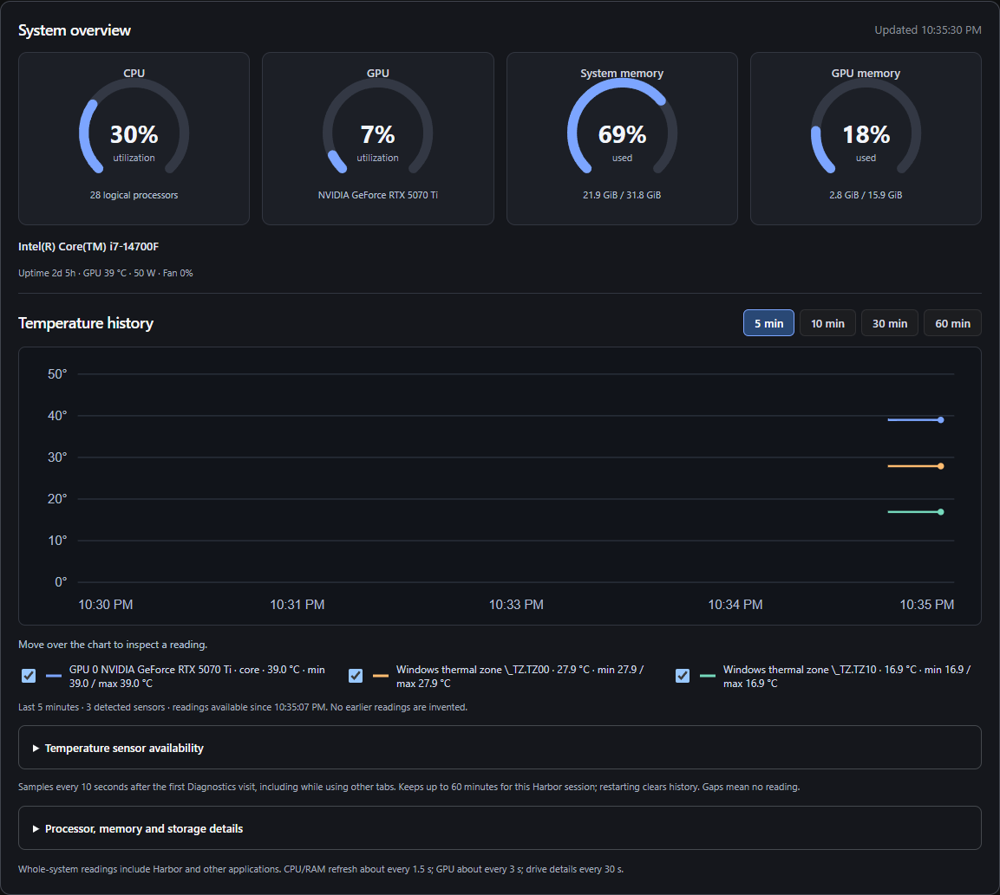

Open Diagnostics to inspect the current load and begin collecting temperature history. Choose a time window and use the legend to select visible sensors. The screenshot contains only readings collected since the tab was first opened; it is a hardware-monitoring view, not a campaign benchmark.

#### Temperature history

Choose **5 min**, **10 min**, **30 min** or **60 min** above the chart. The legend lists each detected sensor's latest, minimum and maximum for the selected window. Toggle a legend checkbox to hide/show a series; moving the pointer over the chart displays nearby measurements. All chart temperatures use degrees Celsius.

Temperature collection begins with the first Diagnostics visit. Unlike the other gauges, it then continues about every 10 seconds while Harbor is running, including on other tabs. Only the latest hour is retained in memory. Exiting Harbor clears the chart history. Selecting 60 minutes immediately after launch does not manufacture the preceding hour. Missing readings and long collection interruptions create gaps.

| Source | Temperatures available when supported |
| --- | --- |
| NVIDIA `nvidia-smi` | GPU core and GPU memory temperatures reported by the driver. Memory temperature is not supported by every device/driver. |
| LibreHardwareMonitor/OpenHardwareMonitor WMI | Every accessible temperature sensor exposed by an already-running provider, potentially including CPU cores, motherboard and other hardware. |
| Windows thermal performance counters | Firmware thermal zones; ACPI temperatures are the fallback if the counters provide no usable zones. |
| Windows storage reliability counters | Drive temperatures exposed by the storage device/provider. Unsupported zero values are not graphed as actual zero-degree drives. |

Expand **Temperature sensor availability** for provider-specific gaps. Harbor does not install privileged sensor drivers or turn firmware-zone names into claims about a particular CPU core. A fixed firmware reading may be stale at its source. The chart reports the provider's measurement; it is not a calibration or hardware-fault diagnosis. GPU gauges currently require NVIDIA telemetry, while the hardware inventory can still list other display adapters. Whole-system readings include other applications and monitoring itself can affect workload measurements.

### Repeatable harness campaigns


#### Scope and prerequisites

The first adapter targets the installed Windows Hermes agent and its configured local llama.cpp model. The default adapter looks under `%LOCALAPPDATA%\hermes` and uses its `hermes-agent\venv\Scripts\python.exe`. It reads the Hermes configuration and existing local model-server state; it does not start, stop, download or switch the model. Start the intended model in Hermes first.

**Check Hermes** verifies the supported installed revision, selected source fingerprints, the recorded model-server PID and the loopback model catalog. The exact compatibility revision is currently `1675f1f2c25ce164f07c42e829f2c17a723db94f`; a different revision fails closed pending adapter revalidation. A saved configuration alone is not a ready result. The model name must be advertised by the active catalog. Weight files are not fingerprinted, so an endpoint that silently changes weights under the same name is outside the identity checks.

Each trial starts a fresh Python process and separate Hermes home, connected only to a private loopback diagnostic MCP gateway on an ephemeral port. Fixtures are synthetic; they do not use personal documents or accounts. Hermes memory, profile/context loading, automatic tool-search wrapping, ordinary built-in tools, background review, checkpoints and saved trajectories are disabled for the controlled run. Output is bounded to 2048 tokens; maximum model turns follow the campaign setting. The ordinary Harbor endpoint, saved Tool Delivery choice and child startup selection are not changed by a campaign. This separation is not an OS security sandbox.

#### Run a campaign

1. Open Diagnostics and choose **Check Hermes**. Resolve any probe failure before interpreting campaign results.
2. Under **Campaign settings**, select the delivery modes. The current adapter offers All tools, BM25, regex, Code Mode, local semantic search and Hybrid. Choose at least two distinct methods for Hybrid.
3. Select repetitions, trial/campaign durations, maximum model turns and optional memory ceilings. Tune the search result limit, semantic threshold and local embedding model as needed.
4. Choose **Start campaign**. Watch the current configuration/task/repetition and completed/planned count. Trials execute sequentially in seeded, balanced randomized order; a fresh conversation/fixture does not imply a cold model load.
5. Use **Cancel campaign** to stop the owned Hermes worker and prevent subsequent trials. Closing the tab does not cancel a campaign. Application exit requests cancellation and cleanup.
6. Review all four comparison views and recent trials, then **Copy results JSON** if a deeper audit is needed. The interface shows the local result-directory location.

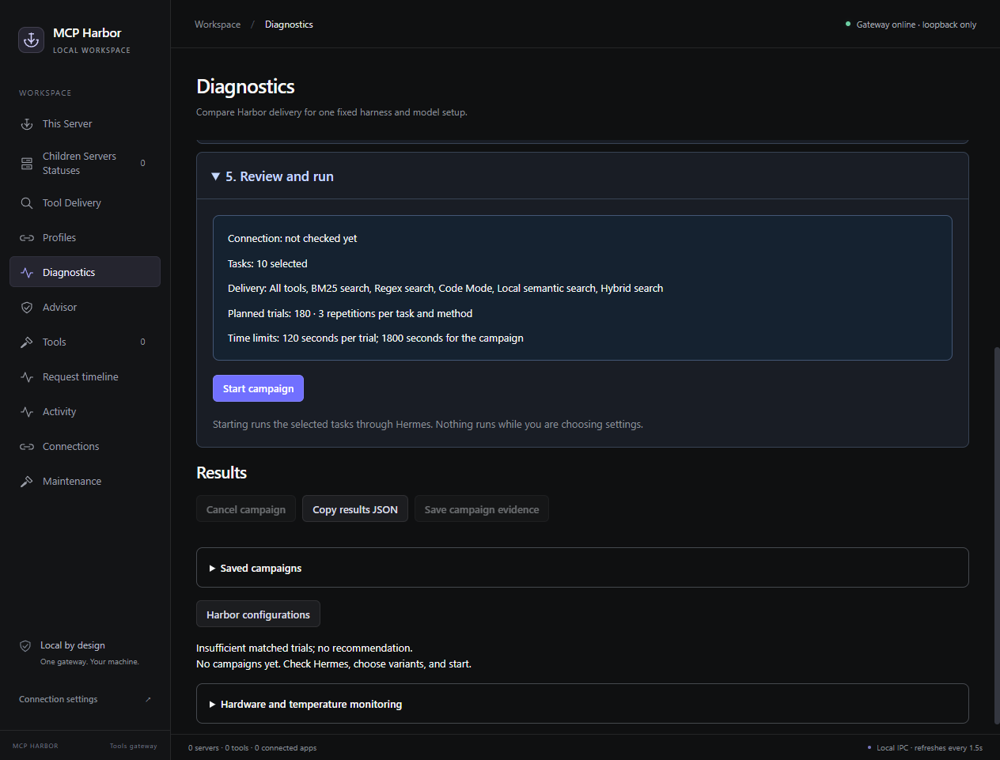

Use **Check Hermes** before starting, then choose delivery variants and resource/time limits under **Campaign settings**. These untouched defaults show the setup stage. Scores and comparisons require an actual campaign with a compatible, running harness and model.

| Setting | Default | Supported bounds |
| --- | --- | --- |
| Repetitions per task/configuration | 3 | 1–30 |
| Trial time | 120 seconds | 10–1800 seconds |
| Campaign time | 1800 seconds | 10–86400 seconds |
| Model turns | 12 | 1–100 |
| Host RAM ceiling | No limit | Positive GiB value or blank |
| Per-GPU memory ceiling | No limit | Positive MiB value or blank; requires available NVIDIA telemetry |
| Variants | Six defaults | 1–24 unique variants; at most 600 total trials |

The normal GUI includes all six task families. Six variants × six tasks × three repetitions gives 108 planned trials, subject to the campaign time limit. Memory ceilings are sampled stop conditions, not OS reservations or hard allocation caps. Host/GPU use includes the existing model server and competing workloads. Brief peaks between samples may be missed. No CPU affinity, model VRAM allocator or thermal/power-control mechanism is provided.

The **Advanced: custom comparison matrix** editor replaces the selected mode controls only when **Use advanced variant matrix instead of the controls above** is checked. It accepts an array of unique variant IDs and supported settings, not an entire campaign object. For example:

```json
[
  {"id":"all","toolMode":"all"},
  {"id":"hybrid-5","toolMode":"hybrid","hybridModes":["bm25","portkey-local"],"searchLimit":5,"semanticMinScore":0.25},
  {"id":"hybrid-10","toolMode":"hybrid","hybridModes":["bm25","portkey-local"],"searchLimit":10,"semanticMinScore":0.25}
]
```

Allowed variant fields are `id`, `toolMode`, `hybridModes`, `searchLimit`, `semanticMinScore` and `portkeyLocalModel`. This adapter rejects hosted embedding variants. A different configured model or harness requires a separate supported pairing; the current GUI is not a model-manager interface.

#### Task pack and grades

The suite checks lookup/write, a dependent lookup chain, recovery from one intentional transient failure, adherence to a forbidden-operation boundary, an exact no-tool response, and appropriate abstention when a requested capability is absent. Fresh seeded values make the required answer dependent on that trial's fixture. Independent fixture state and observed actions drive the grades.

| Measure | Meaning and limits |
| --- | --- |
| Verified completion | Required fixture state and exact tool sequence; for no-tool/abstention tasks, the required structured response and absence of tool calls. A harness completion flag alone is insufficient. |
| Acceptance | An observed schema-valid task action, or the expected no-action response. This is operational engagement/appropriate abstention, not a psychological measure of willingness. |
| Instructions | Required structured final response, permitted sequence and unchanged forbidden state. A task can write the right artifact but fail response-format adherence. |
| Tool selection correctness | Within each trial, fixture calls matching the required sequence with valid arguments and successful/expected-transient outcomes, divided by observed fixture calls. The table averages known trial ratios; discovery-only calls do not count as correct fixture actions. No fixture calls generally leaves this unknown. |
| Argument correctness | Schema-valid calls divided by calls observed at Hermes's execution callback, including discovery wrappers. The table averages known trial ratios. Calls rejected before that callback are not fully observable. |
| False completion claims | A structured `status: done` response without independent completion. This is not a general natural-language deception classifier. |
| Success median / p95 | Total wall time of verified-success trials, including preparation/startup/cleanup. Failed attempts do not enter these success-latency percentiles. All-trial median and timeout information remain in JSON. |
| Harness completed | The harness-reported flag, retained separately for comparison with the independent verifier. |
| Resources | Sampled system RAM/GPU use, host CPU utilization and Hermes worker RSS. The resource sample cadence is about two seconds plus probe time. This does not isolate the model process tree's exclusive consumption. |
| Tokens and cost | Unknown in this adapter. Zero-initialized counters are not presented as measured zero usage or zero cost. |

Eligibility matters. Preparation failures before readiness, cancellations, resource-limit stops and detected configuration/model changes are excluded from quality rates but remain visible. Ready timeouts and observed harness failures can contribute failure evidence. An iteration-limit stop is distinct from a timeout. An ended run without verified completion is not automatically classified as refusal or intentional abandonment.

This is a conformance task pack with exact sequence requirements. A different valid approach can fail the defined rubric. Success on these small synthetic tasks does not establish performance on long coding jobs, general user usefulness or acceptance by a human.

#### Four comparison views

**Harbor configurations**, **Models**, **Harnesses** and **Combinations** group observations by those respective identities. Each trial records the selected Harbor settings, relevant Harbor source fingerprint, harness revision/source fingerprint, configured model/provider/reasoning, hardware identity, suite version, task and repetition. A combination identifies the full configuration/harness/model/hardware tuple.

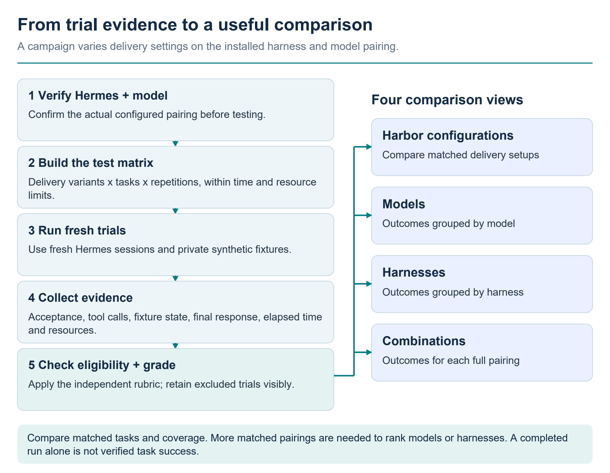

The grader combines observed actions, synthetic fixture state and the required response; a harness's own completion claim is recorded separately. Eligibility checks govern quality rates, while excluded trials remain visible. The four views organize the evidence available: comparing multiple models or harnesses requires additional supported pairings and matched coverage.

The current adapter observes one Hermes/model pairing within a campaign. Thus the Models and Harnesses views usually contain one entry; they have not ranked multiple alternatives. The latest campaign is shown after restart. Older campaign directories remain on disk, but a matched cross-campaign browser/aggregate is not implemented.

A provisional configuration leader requires matching task/repetition/pairing/hardware coverage, at least five eligible observations per configuration and no exclusions. Ordering uses completion first, instruction adherence second and successful-trial median latency third. Completion receives a descriptive Wilson 95% interval. The implemented confirmed-winner rule requires the leading completion interval to be entirely above the others. This is an interval-separation rule for the tested sample, not a paired statistical test, multiple-comparison correction or proof of a universal optimum. Repeated tasks can be correlated. There is no overall weighted score that trades incorrect work for speed.

## 9. Maintenance and recovery

Maintenance is an explicit user action. The UI does not provide a schedule or automatically update every component in the background. The portable manifest groups several servers into shared maintenance units; updating one group may update more than one visible server.

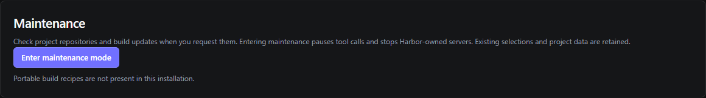

The fresh source profile shown here has no Portable component recipes to run. In the full Portable bundle, open this tab, enter maintenance mode and choose the component's **Update and build** or **Rebuild** action. A missing recipe is not an update failure; component controls require the Portable maintenance manifest.

### Safe routine workflow

1. Finish or stop client tasks, and finish or cancel any Diagnostics campaign. Entering maintenance pauses gateway tool calls, suspends delivery workers, and stops Harbor-owned child services; an unrelated external server's lifetime remains external. Maintenance does not cancel a Diagnostics campaign for you.
2. Open **Maintenance** and select **Enter maintenance mode**.
3. Find the component card. Choose **Update and build** for upstream changes, or **Rebuild** to use the current source/dependency lock where defined.
4. Wait for the displayed phase and log. Only one maintenance job runs at a time; actions and resume are disabled while it is busy. Build commands have cancellation/timeouts; closing Harbor aborts and waits for its active maintenance job during shutdown.
5. Read the outcome. A completed staged verification makes the build eligible for activation. It does not automatically establish every optional account, external service, or end-user workflow.
6. For an ordinary MCP component, select **Resume servers** after the job finishes. Harbor restarts the saved resume set; current code excludes entries removed during maintenance and logs individual restart failures without blocking the others.
7. For **Harbor Portable**, wait for **restart-required**, then use tray **Quit and stop servers** and launch through **Start Harbor**. The launcher activates the verified packaged application. Opening the old executable directly bypasses this activation mechanism.
8. Reconnect the client if necessary and verify representative operations, not only tool counts. Inspect **Children Servers Statuses** and **Activity** for per-server errors.

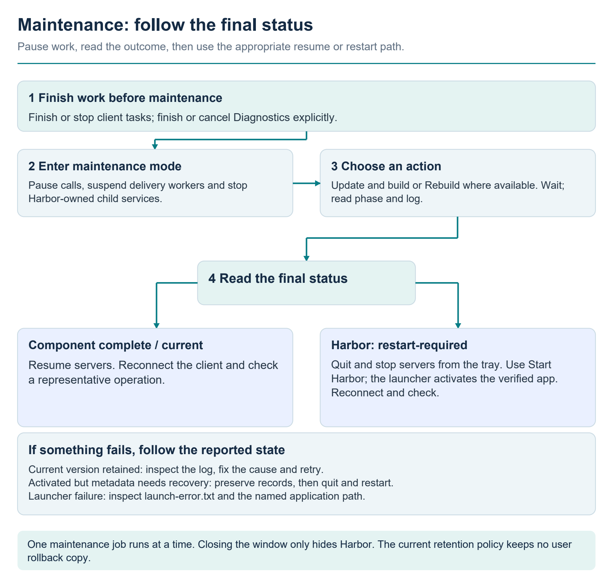

Read the final status before acting. A component update normally returns through **Resume servers**; a Harbor application update requires **Quit and stop servers** and the Portable launcher. A failure before activation retains the current component. A failure after activation can require metadata recovery, so preserve the recorded activation state and follow the reported recovery path.

**Rebuild is not guaranteed offline or bit-for-bit reproducible.** `npm ci` uses lockfiles, but Python source recipes can resolve dependencies from their declared constraints, and downloads may be required if caches are missing. A browser-package update does not automatically replace every browser runtime: the maintenance notes require a matching bundled browser where necessary. Core Node/Python/Git/Typst/Chromium runtimes are not separate automatically updated components in the current maintenance manifest.

### What an update actually does

The engine creates a component staging directory beneath `data/maintenance/staging/`. For maintained Git checkouts it checks for local changes, creates an independent staged checkout, fetches the configured upstream, and merges it into the staged current revision. It refuses to discard uncommitted/untracked local changes. Conflicts or failed verification leave the active component in place. Local committed compatibility fixes can survive as part of the merge; this is not a promise that every future upstream will merge cleanly.

For npm groups, **Update and build** requests the configured package names at their published `latest` tags and records exact direct versions before the normal build. Python lock groups resolve an updated lockfile; individual Python source recipes install their declared dependencies into the staged `python/` directory. GitHub MCP is a release-binary workflow: it requests the official GitHub release asset, requires and checks its published SHA-256 digest, and rejects an archive that escapes the staging directory.

Each component must define verification steps; activation is refused without them. After verification, the engine writes an activation journal, switches directories, and records the result. An interrupted directory switch is recovered before startup. If activation succeeded but writing maintenance metadata failed, the status explicitly reports that distinction and recovery is needed on restart. Do not manually clear journals or replace random directories to silence that status.

### Current retention and rollback policy

This installation sets `retainBackups: false` and `applicationBackups: 0`. **No previous component or application version is retained for user rollback.** The **Restore previous** action is not offered for this policy. A short-lived directory used during activation is a transaction aid, not a retained backup.

Successful component activation removes the prior component; completed/failed staging is removed when no activation journal needs recovery. A pending Harbor self-update activates on the next portable-launcher run; older packaged application releases are pruned then. This policy does not delete user project data as part of application release pruning. If a bad build is discovered after activation, repair/rebuild the current source or obtain a trusted replacement release. Do not promise a rollback copy that is not present. Keep any user-requested protection of irreplaceable project data separate from the application's explicit no-backup release policy.

### Common maintenance failures

| Symptom | Meaning and next action |
|---|---|
| “Enter maintenance mode first” | Stop task use and enter maintenance before retrying. |
| Update button disabled for Harbor | Its local source snapshot has no upstream repository configured; use **Rebuild**. Supplying a GitHub publication URL later does not itself change the runtime recipe. |
| Local changes prevent updating | Preserve/review and commit intended source fixes; do not reset or discard them merely to make the updater run. |
| Merge conflict | Resolve compatible source changes in a development workspace, test them, and then retry with the intended maintained source. The active component was not replaced by the failed merge. |
| Download/dependency failure | Inspect the log for the failing package/network step; check availability and free disk space, then retry after correcting the cause. |
| Verification failed | The replacement is not activated. Inspect the component's verification log; treat account-dependent failures separately from compilation. |
| “New component activated, but maintenance metadata needs recovery on restart” | Allow normal restart recovery; do not remove activation records while recovery is pending. |
| `restart-required` | Quit through the tray, then use the portable launcher. |
| A child fails after Resume | Inspect that child's status/log and verify executable paths, credentials, project path, and compatibility; the remaining valid resume entries are still attempted. |
| Launcher failure | Inspect root `launch-error.txt`. Check the portable marker, current application pointer, and named executable; do not delete `data/servers.json` as a general repair step. |

## 10. Toolbox components and repositories

### Research and web sources


#### Exa — `exa`

Exa provides hosted web search. This catalog entry connects directly to the external Streamable HTTP endpoint `https://mcp.exa.ai/mcp`. It is a service connection, not a local downloaded search engine. It requires internet/service availability. It has no local package group to rebuild in Harbor Maintenance; the remote service controls its own deployed version and tool catalog.

Example: “Use Exa to find official documentation for this library feature. Return the source titles, URLs and short explanations; do not sign in, submit forms or modify anything.”

Check that returned content actually supports the conclusion. A protocol-successful fetch can still return irrelevant, stale or incomplete content. Follow useful results with Fetch or Playwright when direct source inspection is needed. Search terms and requested remote URLs are sent to the service.

#### Brave Search — `brave-search`

Brave is an alternative hosted search provider reached through a bundled local MCP connector. Internet access and a valid Brave API key are prerequisites. The configured connector reads `BRAVE_API_KEY_FILE`; the deferred setup procedure in the credential section supplies that file. This key is independent of gateway/client authentication and embedding-service keys.

After completing the key setup, example: “Search Brave for the official documentation for this API. List the relevant URLs and distinguish official documentation from commentary.”

Until a real authorized search succeeds, describe the package as installed and the live service as unverified. Starting a connector or printing its help is not a test of a Brave account.

#### Fetch — `fetch`

Fetch reads a direct web URL for the caller. Use it when the source is already known and a rendered browser interaction is unnecessary. The target must be reachable; some sites require browser rendering, access controls or interactions that this fetch tool cannot satisfy.

Example: “Fetch `<documentation URL>` and extract the section describing this option. Include the URL and tell me if the content does not contain that section.”

A fetched page is untrusted input. Read the returned source and relevance, not only a successful response flag. Use Playwright if the required content depends on a rendered page.

#### Context7 — `context7`

Context7 retrieves library documentation for implementation work. It requires access to the upstream service and documentation for the intended library; service quotas and account policies remain upstream concerns. Resolve the intended library/version rather than assuming a similarly named result is correct.

Example: “Find the documentation for `<library and version>` and explain the supported configuration for `<feature>`, citing the retrieved section. Do not edit the project.”

Documentation retrieval does not prove the described version is installed in a project. Compare it with the project's actual package manifest/lock before applying a change.

### Code, repositories and browser inspection


#### Serena — `serena`

Serena supplies semantic code navigation and editing through language-aware tooling. It needs the intended project and its language-server prerequisites. New languages or toolchains can require downloads or additional local software even though the project is local. The Portable launch disables Serena's web dashboard and GUI log window; its tools are used through Harbor.

Example: “Activate `<project folder>`, locate the implementation and callers of `<symbol>`, and summarize the call path. Do not edit source files or run build commands.”

Confirm the active project before an editing task. A dedicated server entry with an explicit project is useful for independent workflows, but shared project files still remain shared. The Git/Serena Add-server templates fill launch forms only; they do not install missing language tooling.

#### Git Local — `git-local`

Git Local inspects and operates on a local Git repository. The Portable default selects `data/workspace/repository`; that dedicated repository does not contain another project's history merely because it is running.

To choose an existing repository, open **Configure** and replace the argument after `--repository` with its path, keeping it one JSON string. Save, then Start the server again. Review the configured path before any operation that modifies the working tree, index or history.

Example: “For the configured repository, show the branch, working-tree status and the latest five commits. Do not stage, commit, checkout, reset or fetch.”

This is distinct from GitHub's hosted collaboration tools. A local repository can be inspected without a GitHub account when its files and Git runtime are available.

#### GitHub — `github`

GitHub accesses hosted repository and collaboration APIs through the signed-in account. It requires internet access and the dedicated Portable GitHub profile described in the sign-in section. Available operations depend on the account's permissions and repository visibility. The connector includes write operations; connection success is not a restriction to read-only use.

Example: “For `<owner/repository>`, list open issues matching `<topic>` and summarize their titles and links. Do not create or edit issues, comments, branches or pull requests.”

Check account, repository and scope before requesting changes. Retain existing sign-in during ordinary component maintenance; avoid substituting an unrelated machine-level CLI profile.

#### Playwright — `playwright`

Playwright inspects and automates rendered web pages. The inspected Portable launch uses bundled Chromium in **headless** mode with an **isolated** browser context, so a separate visible browser window and your everyday browser's saved sign-in are not expected by default. A different configured browser/context can change this behavior. Network access depends on the target; a running local site can be inspected offline.

Example: “Open `<local test-site URL>`, report its headings and form labels, and identify visible validation messages. Do not submit forms, make purchases or change records.”

For a task that needs authentication, use an intentional supported browser/session setup rather than assuming the isolated context has the user's cookies. Browser automation can execute code and interact with pages; a headless or isolated context is not an OS security sandbox. Browser binaries must remain compatible with the installed MCP/Playwright package.

### Files, host operations and local planning state


#### Filesystem — `filesystem`

Filesystem reads and edits files within its configured roots. The current Portable wrapper enumerates accessible local drive roots each time it starts; its default scope is therefore broader than `data/workspace`. The Windows account's filesystem permissions still apply.

Example: “List the files in `<project folder>` and read `<specific text file>`. Do not create, rename, delete or edit anything.”

For a narrower entry, configure the bundled filesystem server directly instead of the drive-discovery wrapper. Keep the bundled Node command and use an argument array like this, replacing the sample project path:

```json
[
  "${HARBOR_ROOT}/packages/general-local/node_modules/@modelcontextprotocol/server-filesystem/dist/index.js",
  "C:/Projects/Example"
]
```

Each allowed root is a separate argument. Saving the full entry stops it; start it again and inspect the advertised allowed roots. The wrapper and the direct launch serve different scopes, so do not keep both running for the same task unless that broader access is intentional.

#### Desktop Commander — `desktop-commander`

Desktop Commander provides broad host shell, process and filesystem operations. It is useful when a task actually requires those capabilities. Installed command-line tools and Windows permissions govern what it can do, and invoked commands may access the network.

Example: “List the running processes and report the executable names relevant to `<application>`. Do not terminate a process, run repairs or change configuration.”

Prefer the narrower Filesystem, Git or document server when it covers the job. Being installed locally does not make Desktop Commander read-only or sandboxed. Before asking it to stop a process, establish the actual owner and exact process identity.

#### Memory — `memory`

Memory stores a shared local knowledge graph of entities, observations and relationships. In the Portable launch its state is `data/memory/memory.jsonl`, so the information persists across server restarts and travels with the folder. All clients using this entry see the same upstream store.

Example: “Read the existing Memory graph entries related to `<project name>` and summarize the recorded relationships. Do not add, update or delete observations.”

Use it deliberately for reusable nonsecret facts. It is a general MCP memory server; Harbor does not automatically make every client write project notes to it. A separate Memory entry must use a separate `MEMORY_FILE_PATH` if separate stores are required.

#### Sequential Thinking — `sequential-thinking`

Sequential Thinking supplies a structured step-by-step workspace for the calling agent's reasoning process. It is not a separate chat model, does not supply an AI API account, and does not independently execute the plan it organizes. The Portable entry disables thought logging through its launch setting.

Example: “Use Sequential Thinking to organize a read-only investigation of why these two totals differ. Return the proposed checks; do not run them or change files.”

A well-structured plan still needs evidence. Use the appropriate tool to perform authorized checks and verify the outcomes separately.

### Documents and PDF work


#### Typst PDF Creator — `typst-mcp`

Typst PDF Creator handles structured document authoring, section inspection/revision, bibliographies and compilation. The bundled Typst engine creates PDFs without a TeX installation. Optional LaTeX-specific paths need a separately supplied TeX engine; do not infer that every tool advertised by the upstream has its optional runtime available.

Inspection example: “Read the section structure and figure inventory of `<existing .typ document>`. Report missing section or figure references without editing or compiling it.”

For authoring, ask for a source file and PDF at explicit output paths. Open the resulting PDF to verify layout, table wrapping, headings and page numbering; successful compilation alone does not assess visual quality. The upstream can record its own trace metadata while operating.

#### PDF Tools — `pdf-tools`

PDF Tools manages existing PDFs: extraction, page assembly, splitting/reordering, conversions and form operations. The bundled Markdown-to-PDF path uses Typst. Inputs must be accessible files, and an output operation should use a deliberate separate path when the original should be preserved.

Inspection example: “Inspect `<PDF file>` and report its page count, metadata and readable form-field names/values. Extract the text from the first two pages in the response. Do not fill fields or save changes.”

Tesseract OCR is not bundled. Optional Camelot/Tabula table extraction and PDF-to-DOCX reconstruction are not established parts of the Portable workflow. A scanned page may have no useful text layer, and extracted text/tables may need visual checking against the original. Dynamic XFA layout needs suitable Adobe software; ordinary form inspection is not proof that dynamic forms can be rendered or edited here. Use Typst for new typeset documents and PDF Tools for existing-PDF operations.

#### Word Documents — `word`

Word Documents creates and edits DOCX files, including headings, tables, lists, images, comments and tracked changes, without requiring Microsoft Word to create those files. Existing files must be accessible and the requested operation must be supported by the advertised tool schema.

Inspection example: “Open `<DOCX file>` with a new document handle and list its headings and tables. Do not edit or save the document.”

Use a distinct document handle for each independent concurrent workflow. In-memory edits must be saved to an explicit path before stopping the server; avoid treating another client's active document as yours. Optional PII-detection models are not bundled or validated. Producing a DOCX does not establish that every target Word version will render it identically.

#### Excel — `excel`

Excel creates and edits XLSX workbooks, sheets, cells, formatting, charts and stored formulas without requiring Microsoft Excel. Work on explicit workbook paths and preserve original inputs when the task asks for a revised copy.

Inspection example: “Read `<XLSX file>`, list its worksheets and report the values and formulas in `<sheet and range>`. Do not modify or save the workbook.”

The openpyxl-based tool stores formulas but does **not recalculate them**. Cached formula results can be absent or stale until an appropriate calculation engine processes the workbook. For verified totals, calculate from the input values using DuckDB or another suitable engine and distinguish calculated numbers from cached spreadsheet values. Reading a formula string is not evaluating it.

#### MarkItDown — `markitdown`

MarkItDown converts supported document content, including Office files, PDFs and HTML, into Markdown for reading and analysis. Local document conversion does not require a cloud API key. Optional audio/transcription, OCR or cloud features can require additional runtimes, model files or services.

Example: “Convert the content of `<existing document>` to Markdown in the response and summarize its headings and tables. Do not write an output file or change the original.”

This conversion preserves readable content rather than the original visual page layout. Check the original when precise table alignment, image meaning, page positions or scanned text matter. Pair it with Word/Excel inspection when you need to verify a generated document's actual contents.

### Databases and analysis


#### DBHub — `dbhub`

DBHub exposes database schema discovery and SQL. The Portable default is SQLite at `data/workspace/harbor.sqlite`, with SQL reads and writes enabled. The database persists across Harbor restarts and travels with the Portable folder. Local SQLite use needs no cloud account, Docker service or separate database server.

Inspection example: “List the tables and columns in the configured DBHub database, then run a SELECT to count the rows in `<existing table>`. Do not create, alter, insert, update or delete data.”

The current upstream supplies `search_objects` for object discovery and `execute_sql` for queries/changes; use their actual namespaced forms from Harbor discovery. A SELECT request is an instruction for that task, not a server-wide read-only access policy.

To choose another SQLite file:

1. Open **Children Servers Statuses → DBHub → Configure**.
2. Replace the argument after `--dsn`, retaining it as one string. For example, use `sqlite:///C:/Projects/Example/app.sqlite` for a selected Windows file. For a file carried with Portable, keep the literal root token as in `sqlite:///${HARBOR_ROOT}/data/workspace/harbor.sqlite`.
3. Save and Start DBHub again. Its previous configured connection stops when the full launch configuration is saved.
4. Inspect the database identity/schema and known records before issuing writes. A valid connection to an empty unintended file is not proof that the expected database was opened.

For multiple sources, replace the `--dsn` pair with `--config` and the absolute path to a chosen DBHub TOML configuration. The installed `packages/dbhub/dbhub.toml.example` documents supported source fields. Copy and edit only the intended sources; do not run the example's illustrative connection details unchanged. The current maintained loader requires an explicit `--config` selection rather than trusting an ambient file in the working directory.

PostgreSQL, MySQL/MariaDB and SQL Server support needs an existing reachable database, database-specific credentials and appropriate permissions. The database services are not bundled or created by Harbor. Keep secret-bearing database configuration private. Default SQLite writes do not imply the same permissions or tested behavior for a remote database.

#### DuckDB — `duckdb`

DuckDB is suited to analytical SQL over CSV, Parquet and local database data: filtering, joins, grouping and totals. The inspected launch uses `--db-path :memory:`, `--read-write` and `--allow-switch-databases`. It starts with an in-memory database; ordinary tables created there disappear when the server stops. Local work does not need a MotherDuck account.

Inspection example: “Read `<CSV file>` with DuckDB and calculate row count, missing-value counts and totals by `<column>`. Return the SQL and results without creating tables or modifying the file.”

For persistent work, either configure `--db-path` to an explicit DuckDB file for subsequent launches or intentionally switch the live connection to a named file with the advertised `switch_database_connection` tool. An existing file is required unless the caller explicitly requests `create_if_not_exists: true` in the configured read-write mode. Switching does not automatically copy the old in-memory tables into the new database. Save/export or rebuild any intended data first, and confirm the current database before writing.

All clients of this entry share its current connection. A database switch affects that shared server, so separate simultaneously used databases should have dedicated entries or an explicitly coordinated workflow. If you need an existing file to be opened read-only, remove `--read-write` from a dedicated file-based launch and validate the upstream's available tool behavior; an in-memory launch requires read-write mode. Remote MotherDuck use is an optional service with separate account/network requirements.

### Choosing related tools together


| Task | Useful combination | What to verify |
| --- | --- | --- |
| Inspect an unfamiliar codebase | Serena plus Git Local; Context7 when library documentation is needed | Correct active project/repository and installed library versions. |
| Research a public technical claim | Exa or Brave, then Fetch; Playwright for rendered content | The source actually supports the claim, with dates/version context where relevant. |
| Produce a document and check its contents | Word or Excel, plus MarkItDown or the native document inspector | Saved path and readback; spreadsheet formula results require separate calculation. |
| Author a polished PDF | Typst PDF Creator; PDF Tools for page/form operations | Compile success, saved PDF and visual layout inspection. |
| Analyze tabular files | DuckDB; Excel for a workbook deliverable | Input schema, SQL results and whether the database needs persistence. |
| Keep application records | DBHub with a selected persistent SQLite database | Correct database identity, schema and authorized write scope. |

Starting more servers is not automatically better. Use the smallest set covering the task, then add another when it supplies a distinct capability. Search delivery modes can reduce the up-front tool catalog, but they do not impose per-tool permissions. Gateway access control and the upstreams' own permissions are documented separately.

### Maintenance groups and upstream sources


The authoritative recipe list for a distributed bundle is its root `maintenance.json`; the source definitions are in `scripts/portable/stage-release.mjs`, `office-components.mjs`, `dbhub-component.mjs`, and `delivery-components.mjs`. Repository URLs below are copied from those configured sources, not assumed from similarly named projects. Exact dependency versions belong in the final generated inventory and package locks.

| Maintenance ID / visible group | Upstream or package source | Build and activation checks |
|---|---|---|
| `general-local` / Filesystem, Memory, Thinking and Desktop Commander | npm: `@modelcontextprotocol/server-filesystem`, `@modelcontextprotocol/server-memory`, `@modelcontextprotocol/server-sequential-thinking`, `@wonderwhy-er/desktop-commander` | Update direct package versions; `npm ci`; MCP discovery probes for all four. |
| `browser-docs` / Playwright and Context7 | npm: `@playwright/mcp`, `@upstash/context7-mcp` | Update packages; `npm ci`; discovery probes. Matching browser runtime is a separate compatibility concern. |
| `typst-mcp` / Typst PDF Creator | `https://github.com/edward-lcl/typst-mcp.git` | npm locked install, build, upstream tests, MCP probe. Local compatibility fixes are part of the maintained checkout. |
| `harbor` / Harbor Portable | `packages/harbor-source`; no upstream configured yet | `npm ci`; `npm run pack -- --win --config.directories.output=artifact`; `npm test`; launcher activation of `artifact/win-unpacked`. |
| `serena` / Serena | `https://github.com/oraios/serena.git` | uv installation into staged `python/`; MCP discovery. New language servers may require downloads. |
| `python-tools` / Fetch and Git Local | Python packages `mcp-server-fetch`, `mcp-server-git`; constrained `mcp<2` | Update compiled requirements; uv install from requirements; both MCP probes. |
| `search` / Brave Search | npm `@brave/brave-search-mcp-server` | npm locked install; CLI `--help` check. A real authorized search remains a separate key-dependent acceptance test. |
| `github` / GitHub | Official `github/github-mcp-server` release, `https://github.com/github/github-mcp-server` | Windows x86_64 asset download, SHA-256 validation, version check, MCP probe using configured account. |
| `pdf-tools` / PDF Tools | `https://github.com/rsp2k/mcp-pdf.git` | uv install with forms/Markdown extras, `pypandoc_binary`, `fastmcp<3`, `mcp<2`; MCP and real PDF workflow probes. |
| `duckdb` / DuckDB | `https://github.com/motherduckdb/mcp-server-motherduck.git` | uv installation; office-tool verification covering local DuckDB. Local use does not require MotherDuck. |
| `markitdown` / MarkItDown | `https://github.com/microsoft/markitdown.git` | Install local `markitdown[all]` and `markitdown-mcp` package subdirectories; conversion verification. |
| `excel` / Excel | `https://github.com/haris-musa/excel-mcp-server.git` | uv installation with `mcp<2`; workbook verification. openpyxl does not recalculate formula caches. |
| `word` / Word Documents | `https://github.com/SecurityRonin/docx-mcp.git` | uv installation with `mcp<2`; document verification. Separate document handles are required for independent concurrent workflows. |
| `dbhub` / DBHub | `https://github.com/bytebase/dbhub.git` | Bundled pnpm frozen-lockfile/hoisted install, build, SQLite integration tests, production install, MCP write/persistence verification. |
| `fastmcp-tools` / FastMCP tool discovery and Code Mode | Python `fastmcp[code-mode]>=4.0.5,<5`; project `https://github.com/PrefectHQ/fastmcp` | Updated requirements lock, uv target install, search and code-execution component checks. |
| `portkey-tools` / Portkey semantic tool search | `https://github.com/Portkey-AI/mcp-tool-filter.git` | npm locked install/build, production prune, local semantic retrieval verification. Bundled model assets are separate under `runtimes/embedding-models`. |

## 11. Architecture and data ownership

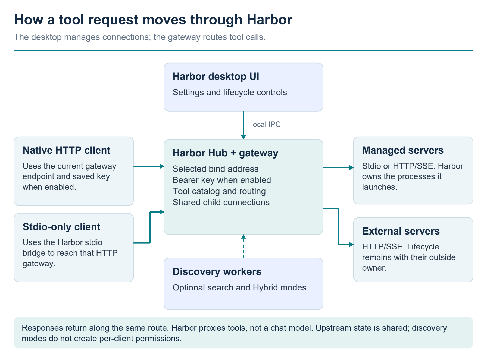

Clients reach the HTTP gateway directly or through the stdio bridge. The gateway applies the selected bind and API-key settings, then routes namespaced calls through shared upstream connections. Desktop controls use local IPC. Harbor supervises the processes it launches; an external service keeps its outside owner. Optional discovery workers change how tools are found.

The application has five operational layers:

1. **Desktop shell and IPC:** Electron loads local UI assets and a narrow preload API. The renderer has context isolation and no Node integration; navigation/new windows and permission requests are restricted. Ordinary configuration remains in the local desktop, not an HTTP administration endpoint.
2. **Hub and settings:** The hub serializes configuration mutations, maintains settings, coordinates maintenance and exposes runtime snapshots. A candidate endpoint/delivery configuration is prepared before a settings change becomes active. Child servers remain running when only gateway settings change, but clients may need to reconnect.
3. **Gateway, routing and discovery:** A Streamable HTTP listener manages MCP client sessions and checks the saved bearer key when **Use API key** is enabled. Tool metadata is namespaced and routed to the proper upstream. Optional FastMCP/semantic workers provide discovery methods while the same upstream connections remain shared. External calls to the raw-catalog MCP path follow gateway authentication too; that full-catalog route is not a per-tool permission boundary.
4. **Upstream/process supervision:** Stdio, HTTP and SSE connections use the MCP SDK. Native and WSL supervisors manage explicitly owned foreground process trees. External service connections are not process ownership. Catalog refresh follows upstream tool-list changes and rejects duplicate names or repeated pagination cursors.
5. **Independent operating modules:** Advisor computes local recommendations; Maintenance uses portable recipes to build and activate components; Diagnostics uses private test gateways, separate result storage and its own worker/telemetry lifecycle. They call explicit backend operations rather than simulated buttons.

In Portable, ordinary state belongs under `<Harbor folder>\data`. `servers.json` holds server launches and startup/restart preferences; `harbor-settings.json` holds endpoint/delivery choices. `data/auth/gateway.json` holds the separate plaintext gateway key and its enabled state; hosted embedding keys are stored under `data/auth/embeddings`. Cached UI/runtime data, logs and temporary files have their respective data subdirectories. Child servers may also use configured package or project directories: inspect each launch recipe to determine what data travels with the folder and what remains machine-local.

Diagnostics stores `data\diagnostics\latest.json`, a UUID directory per campaign, per-trial `result.json` files and isolated trial Hermes homes. Content-hashed adapter/probe scripts are materialized there for native Python/PowerShell, which cannot execute a file inside Electron's virtual ASAR archive. Synthetic arguments/results and final responses can be retained. The adapter does not copy personal prompts, ordinary session databases, memory or authentication files. Its existing local model key is read into worker memory and is not written into isolated configuration or emitted to the UI event stream.

The Windows campaign lock uses an exclusive OS ownership claim plus owner metadata. A stale lock is recovered only after its recorded owner is confirmed dead on the same host. A live or indeterminate owner is not deleted automatically. Previously unfinished results reopen as interrupted; they are not silently marked successful. Do not delete a campaign lock to force two controllers to run against the same result directory.

### Maintenance and shutdown behavior

Complete or cancel Diagnostics campaigns before maintenance. Entering maintenance pauses gateway requests, releases delivery workers and disconnects/stops upstream activity according to ownership; it does not itself cancel the separate diagnostic campaign. Previously running/starting entries are recorded for resumption. Server selections and project data are retained. Component operations require maintenance mode and only one maintenance job runs at a time. Resume uses the current saved entries and startup decisions; a removed or unchecked entry should not be revived.

A requested application quit closes maintenance work, Diagnostics/telemetry and the hub. Shutdown proceeds through other cleanup stages even if a stage reports an error. The window's close button intentionally does not request this shutdown. Do not replace files underneath a running build or terminate arbitrary processes with matching names; follow the packaged maintenance workflow and its recorded ownership.

## 12. Source builds and release packaging

The project repository is `https://github.com/csorrells42/Harbor.git`. Build the Harbor application from that repository with:

```powershell
git clone https://github.com/csorrells42/Harbor.git
Set-Location Harbor
npm ci
npm start
```

The application requires Node 22 or newer; the checked-in CI uses Node 24 and the portable build supplies Node 24. Use Node 24 for the documented reproducible development baseline. Managed tools still need their own server/runtime installations when running the ordinary app from source. The source app can use All tools with separately configured upstreams. Other delivery modes, including hosted semantic search, require a compatible Portable worker runtime. For development, point `HARBOR_TOOL_RUNTIME_ROOT` at that existing runtime; npm installation or an embedding API key alone does not install the workers/models.

```powershell
npx --no-install playwright install chromium
npm test
npm run test:ui
npm run pack -- --win
npm run dist:win
```

`pack` produces an unpacked app; `dist:win` produces the unsigned NSIS installer under the configured output directory, normally `release/`. Linux targets are available through `npm run dist:linux` and need target-specific GUI libraries and validation. The Windows renderer tests also require Microsoft Edge. Linux browser tests use `npx --no-install playwright install --with-deps chromium`; Electron tests need a graphical session or Xvfb. Optional installed-Hermes/tool-runtime tests use explicit environment opt-ins. The checked-in GitHub Actions workflow has Windows/Ubuntu test and packaging jobs; it is configuration, not evidence that those jobs have passed on the project repository.

**Complete portable assembly currently has external build inputs.** The public source export omits the machine-specific `assemble.mjs` used for the original local installation; the following describes that existing maintainer workflow, not a script supplied as a public bootstrap. `scripts/portable/assemble.mjs` reads installed/local build-runtime and upstream locations, including a Node installation, cached Python/Git/Typst assets, local upstream packages, and a verified tool-delivery runtime selected by `HARBOR_TOOL_RUNTIME_ROOT`. It is a maintainer staging helper and explicitly reports that additional Python setup, maintenance recipes, and desktop packaging are required. `stage-release.mjs` assembles the desktop/source snapshot and recipes after those inputs exist. These helpers are not a clean one-command portable bootstrap from a Git clone. The supported end-user maintenance path is the existing verified portable bundle's **Maintenance** tab.

For public release, package application code, documentation, dependency/license material, and sanitized configuration seeds. Keep live `data/`, credentials, private diagnostics, logs, and user workspaces out of GitHub and public archives. The installation's “single current version, no backups” behavior must remain consistent with the packaged manifest. The PDF and equivalent Markdown manual must travel with app releases and the maintained source snapshot. Verify both after a release build.

## 13. Troubleshooting

### Connection problems


| Symptom | What to check |
| --- | --- |
| Connection refused / no client session | Start Harbor, copy the currently displayed endpoint, confirm port/interface and firewall. A closing window can leave Harbor in the tray; conversely, a running model server is not proof Harbor is running. |
| HTTP 401 / rejected key | Copy the current saved key/configuration from Harbor, verify the Bearer header or bridge environment, and reconnect. Do not substitute the Brave or embedding-service key. An old session ID does not authorize a request with a missing/old key. |
| HTTP 403 | Use an advertised host/address and correct port. For a browser client, inspect its exact Origin and requested headers. The new bridge reports both 401 and 403 as authentication failures, so its generic message can also represent a Host/Origin rejection. |
| HTTP 404 | Check the exact path and absence of added query/trailing slash. An invalid old MCP session also requires reconnecting. |
| HTTP 400 or invalid/missing session on browser GET | Use a real MCP initialize handshake instead of treating the route as a web page. |
| HTTP 413 | Request body exceeded the gateway's 1 MiB limit. Reduce the request size. |
| HTTP 503 / Gateway unavailable | Check whether maintenance has paused the gateway or shutdown/rebinding is in progress. Resume after maintenance finishes, then reconnect. |
| Zero raw tools | Check child-server statuses and Activity. Saving/importing a definition does not start it. |
| Only a few tools visible to the model | Check active delivery mode. Search modes advertise discovery/invocation entry points, not the complete raw catalog. |
| Unknown tool / stale tool schema | Reconnect the client and discover again after server or delivery changes. Use the exact returned name and schema. |
| Search provider error after Apply succeeded | Apply is not a live credential test. Check endpoint, embedding model, dimensions, credential and service availability; run a real search. |
| Brave Search cannot start | The intentionally deferred key file must exist and contain a valid key; then restart and verify an actual search. |
| GitHub needs sign-in | Check the bundled CLI's `data/auth/gh` profile, not another machine-level CLI profile. |
| Bridge path not found after update/move | Copy a fresh Stdio bridge configuration from the current Harbor window. Use the new bridge version for `HARBOR_API_KEY` / key-file support. |
| Client still uses the old key after rotation | Restart its MCP connection or stdio bridge; a running bridge reads its key only at startup. Copy the **saved** key after Apply, not an unsaved draft. |
| Long task ends after five minutes through bridge | The bridge caps its individual request duration at 300 seconds even if the gateway allows longer. |

### Desktop, server and diagnostic problems


| Symptom | Check and recovery |
| --- | --- |
| No window, but Harbor still runs | Use the tray icon or launch again. Closing the window hides it. If it is a first-launch failure, inspect the launch log and verify the active executable rather than assuming a port proves a visible window. |
| Gateway startup reports a busy port | Identify the owner of the chosen port. Close the conflicting gateway or deliberately change Harbor's port; reconnect clients using the displayed endpoint. Saved configuration is not replaced by this startup error. |
| Child stays in Error | Read its card and Activity. Check executable/runtime, argument JSON, working directory, permissions, dependency installation and target service readiness. After repair, retry with its individual Start/Restart. |
| HTTP/SSE Stop did not kill a service | Check the ownership tag. An external entry controls only Harbor's connection. The outside owner must stop the service. |
| A checked Advisor entry does not run immediately | A checkbox saves startup preference. Select **Start selected** for immediate startup, then inspect each result. A blocked prerequisite or Error is not bypassed. |
| An unchecked server is still running | Unchecking disables future automatic startup/restart but deliberately leaves the current process available. Use **Stop** when ready. |
| Client cannot connect after settings change | Copy the current endpoint and reconnect. Check port/path/bind address, maintenance state and host/origin restrictions. A bare browser GET is not a full MCP readiness test. |
| HTTP 401 or client authentication failure | Confirm **Use API key** and obtain the current saved key/configuration from **This Server**. Apply a generated replacement before copying it, update the client and reconnect. A Brave or embedding-service key is not the gateway key. |
| Copy key still returns the old key | **Generate new key** changes only the draft. Select **Apply protections** to save the replacement, then **Copy key**. |
| A remote client cannot connect | Check that **Loopback only** is off, the chosen bind/address is reachable and the client supplies the gateway key when enabled. Disabling the key alone does not turn off loopback restriction. |
| Client cannot see expected tools | Ensure the relevant child is running and inspect Tools. Reconnect the client after delivery/catalog changes. Search modes advertise discovery tools instead of the complete catalog. |
| Semantic search finds nothing | Inspect the current catalog, query wording, selected embedding model and minimum relevance. Check provider errors if hosted. Applying a saved provider configuration does not prove connectivity. |
| Hosted semantic search fails | Verify endpoint/model/dimensions and the provider-specific key. Avoid putting secrets in URLs. Confirm whether a local endpoint actually requires authentication. |
| Brave Search reports its key is missing | This is the deliberately deferred credential setup. Add the intended key through its documented upstream file workflow, then start and test that server; another provider's embedding key is not a substitute. |
| Maintenance buttons are disabled | Enter maintenance mode and wait for the active maintenance job. A non-portable installation may not contain portable recipes. Do not run concurrent builds into the same component. |
| Check Hermes says the model server is not running | Start the intended local model in Hermes. Harbor does not auto-start the benchmark model. Retry the probe. |
| Check Hermes rejects revision/model | Verify the installed adapter compatibility and current Hermes configuration. A changed revision needs revalidation; do not defeat the gate by editing its recorded version. |
| Campaign cannot start because ownership is active | Wait for the owning campaign/process, cancel through its window if appropriate, then retry. Unknown owner state is not proof the lock is stale. |
| Campaign has no recommendation | Inspect exclusions and matching coverage. Complete matched trials with sufficient eligible observations. Overlapping intervals legitimately mean no confirmed winner. |
| GPU or CPU temperatures are absent | Check Temperature sensor availability. Firmware/driver/provider access governs what can be measured. Core sensors need an accessible provider; firmware zones are not substitutes for CPU-core measurements. |
| The 60-minute chart is mostly empty | History begins on the first Diagnostics visit and is held only for the current Harbor process. Let it collect; a restart clears earlier samples. |
| Activity lost older messages | Activity retains the newest 500 entries in memory, with each message bounded to 8192 characters. Use relevant durable component/build/result files for longer investigations; Activity is not a complete audit log. |

## 14. Security and operating boundaries

The gateway's optional shared bearer key and optional loopback restriction are independent; new installations enable both. A saved disabled choice persists. The key restricts gateway access but provides neither TLS nor per-client/per-tool permissions. With the key disabled, any process or device that can reach the selected listener can call its available tools. Harbor does not create firewall/router rules. The plaintext gateway store, server environment files and provider credential files require ordinary filesystem protection and must not be included in a public distribution containing real keys. Explicit clipboard copies of a key or authenticated configuration contain secrets even though ordinary snapshots/previews do not.

Diagnostics currently supports one installed Windows Hermes/local llama.cpp pairing and a small synthetic suite. It does not automatically choose/download models, rank several harnesses from a single campaign, aggregate unmatched historical campaigns, apply a recommended production configuration, measure authoritative cost/token usage, or enforce hard hardware allocations. Temperature availability is provider-dependent. External-account functionality must be tested with authorized credentials; a deferred missing key should remain explicitly unverified.

## 15. Licensing, attribution and contact

### Harbor's license and author

Harbor's original application code and this manual are licensed under the MIT License. Copyright (c) 2026 Christopher Sorrells (csorrells42), with the existing MCP Harbor contributors notice preserved. The repository's `LICENSE` contains the complete terms.

The MIT license permits use, copying, modification and distribution, including commercial use, provided its copyright and permission notice remain with copies or substantial portions. It provides no warranty. It does not require a prominent application-screen credit or endorsement. See the [Open Source Initiative's MIT text](https://opensource.org/license/mit).

Author and maintainer: **Christopher Sorrells (csorrells42)**. Contact: [clsorrells42@gmail.com](mailto:clsorrells42@gmail.com). Christopher is open to software engineering opportunities and project enquiries. A link to [the Harbor project](https://github.com/csorrells42/Harbor) is appreciated when sharing or discussing the work.

### Third-party components keep their own licenses

Harbor's MIT license applies to Harbor's original work, not to the entire collection of third-party runtimes, models, packages or hosted services. Preserve upstream copyright, license and NOTICE files. The source dependency inventory and third-party notice collection identify the checked components; package and lockfile versions define the relevant releases.

The Portable toolbox contains separately licensed programs and libraries. Material examples include GPL-licensed Serena and Git components, AGPL/commercial dual-licensed PyMuPDF in the PDF Tools environment, LGPL components and codecs, MPL-licensed libraries, and model-specific licenses. Permissive MIT/Apache/BSD components also have notice obligations. Network services impose their own terms and account conditions.

### Publication and redistribution boundaries

The public Harbor source repository contains the original application, its tests, build helpers and documentation. It does not contain the personal Portable data directory, credentials, third-party runtime binaries or model weights. Installing dependencies from their upstreams is distinct from redistributing a preassembled binary toolbox.

An application-only Electron package must retain Electron/Chromium notices and the included production dependency notices, as well as Harbor's MIT notice. A complete Portable toolbox additionally requires an exact component inventory and applicable license texts, required notices, and any corresponding-source or other obligations for those binaries and local patches. An upstream URL alone is not assumed to satisfy every source-distribution requirement. See the release-specific licensing inventory before publishing a full toolbox archive.

Do not remove an upstream license or label copied third-party source as solely Christopher's work. Do not include a private/commercial license key in an archive. If you elect commercial licensing for a dual-licensed component, establish the applicable entitlement rather than assuming it follows from Harbor's MIT license.

### Licenses for all default Harbor servers

This catalogue lists all **19 default server entries** individually. It describes the server package's primary license at the inspected installed version. Dependencies, bundled executables, models, and hosted services can have additional terms. Original Harbor code is separately MIT-licensed, copyright Christopher Sorrells (csorrells42).

The license files below are included in the documentation package under `third-party/portable/`. SHA-256 hashes and source provenance are recorded in `third-party/portable/provenance-manifest.json`. Exact source revisions are retained where identified. Version values reflect the September 18, 2026 installed snapshot and were rechecked after the component updates. Recheck this catalogue when updating the toolbox.

| Default server / ID / installed version | Primary license | Included full notice | Source and qualification |
|---|---|---|---|
| **Serena** (`serena`) — `serena-agent 2.0.0.dev0` | **GPL-3.0-or-later** application; SolidLSP remains **MIT** | [Licensing overview](../third-party/portable/serena/LICENSE), [GPL text](../third-party/portable/serena/GPL-3.0-or-later.txt), [MIT text](../third-party/portable/serena/MIT.txt) | [oraios/serena](https://github.com/oraios/serena). Current version is after the project's v2 license transition; an older MIT-only description would be wrong. |
| **Context7** (`context7`) — `@upstash/context7-mcp 4.1.1` | **MIT** | [context7/LICENSE](../third-party/portable/context7/LICENSE) | [upstash/context7](https://github.com/upstash/context7). This identifies the connector code; hosted documentation/API service terms are separate. |
| **Playwright** (`playwright`) — `@playwright/mcp 0.0.82` | **Apache-2.0** | [playwright-mcp/LICENSE](../third-party/portable/playwright-mcp/LICENSE) | [microsoft/playwright-mcp](https://github.com/microsoft/playwright-mcp). The separately bundled browser, FFmpeg, and other helpers retain their own notices. |
| **GitHub** (`github`) — GitHub MCP Server `v1.12.2` | **MIT** | [github-mcp/LICENSE](../third-party/portable/github-mcp/LICENSE) | [github/github-mcp-server](https://github.com/github/github-mcp-server). GitHub account/service terms and bundled GitHub CLI notices are separate. |
| **Filesystem** (`filesystem`) — `@modelcontextprotocol/server-filesystem 2026.8.31` | **Apache-2.0 with retained MIT contributions**, per the exact source licensing-transition notice | [mcp-server-filesystem/LICENSE](../third-party/portable/mcp-server-filesystem/LICENSE) | [Exact published source license](https://github.com/modelcontextprotocol/servers/blob/a40bc270fb5ece62673f8a1196f57116d885c5eb/LICENSE). npm says `SEE LICENSE IN LICENSE`; registry gitHead and lock integrity establish this source-notice mapping. |
| **Memory** (`memory`) — `@modelcontextprotocol/server-memory 2026.8.31` | **Apache-2.0 with retained MIT contributions**, per the exact source licensing-transition notice | [mcp-server-memory/LICENSE](../third-party/portable/mcp-server-memory/LICENSE) | [Exact published source license](https://github.com/modelcontextprotocol/servers/blob/a40bc270fb5ece62673f8a1196f57116d885c5eb/LICENSE). This is the persistent MCP Memory server. |
| **Sequential Thinking** (`sequential-thinking`) — `@modelcontextprotocol/server-sequential-thinking 2026.8.31` | **Apache-2.0 with retained MIT contributions**, per the exact source licensing-transition notice | [mcp-server-sequential-thinking/LICENSE](../third-party/portable/mcp-server-sequential-thinking/LICENSE) | [Exact published source license](https://github.com/modelcontextprotocol/servers/blob/a40bc270fb5ece62673f8a1196f57116d885c5eb/LICENSE). See the original transition text rather than assuming a uniform MIT license. |
| **Desktop Commander** (`desktop-commander`) — `@wonderwhy-er/desktop-commander 0.2.51` | **MIT** | [desktop-commander/LICENSE](../third-party/portable/desktop-commander/LICENSE) | [wonderwhy-er/DesktopCommanderMCP](https://github.com/wonderwhy-er/DesktopCommanderMCP). Dependency terms remain separate. |
| **Fetch** (`fetch`) — `mcp-server-fetch 2026.8.18` | **MIT**, as declared in this installed Python distribution | [fetch/LICENSE](../third-party/portable/fetch/LICENSE) | [MCP Fetch source](https://github.com/modelcontextprotocol/servers/tree/main/src/fetch). The installed version's full MIT text is preserved; do not silently replace it with a future source license. |
| **Git Local** (`git-local`) — `mcp-server-git 2026.8.18` | **MIT**, as declared in this installed Python distribution | [git-local/LICENSE](../third-party/portable/git-local/LICENSE) | [MCP Git source](https://github.com/modelcontextprotocol/servers/tree/main/src/git). The bundled Git executable separately carries GPL v2 notices. |
| **Exa** (`exa`) — hosted endpoint; service build/version not published by this configuration | **Hosted-service terms**, not a locally bundled server-code license. Related open-source connector is **MIT** | [Hosted-service distinction](../third-party/portable/exa-oss-reference/HOSTED-SERVICE.md), [related OSS LICENSE](../third-party/portable/exa-oss-reference/LICENSE) | Harbor connects to `https://mcp.exa.ai/mcp`. [Exa terms](https://exa.ai/assets/Exa_Labs_Terms_of_Service.pdf) govern service use. [exa-labs/exa-mcp-server](https://github.com/exa-labs/exa-mcp-server) is a related MIT repository; its license does not establish the hosted deployment's identity or replace service terms. |
| **Brave Search** (`brave-search`) — `@brave/brave-search-mcp-server 2.1.4` | **MIT** | [brave-search/LICENSE](../third-party/portable/brave-search/LICENSE) | [brave/brave-search-mcp-server](https://github.com/brave/brave-search-mcp-server). Brave Search API access is separate; its key and live acceptance remain intentionally deferred. |
| **Typst PDF Creator** (`typst-mcp`) — `typst-mcp 0.1.0` | **MIT** | [typst-mcp/LICENSE](../third-party/portable/typst-mcp/LICENSE) | [edward-lcl/typst-mcp](https://github.com/edward-lcl/typst-mcp). The bundled Typst executable separately uses Apache-2.0 plus third-party notices. |
| **PDF Tools** (`pdf-tools`) — `mcp-pdf 2.3.0` | **MIT** for the server project | [pdf-tools/LICENSE](../third-party/portable/pdf-tools/LICENSE) | [rsp2k/mcp-pdf](https://github.com/rsp2k/mcp-pdf). Material separate dependencies include PyMuPDF 1.28.2 (**AGPL-3.0 or Artifex commercial**) and Pandoc 3.9 (**GPL-2.0-or-later**). Their collected notices do not by themselves establish source-distribution completeness. |
| **DuckDB** (`duckdb`) — `mcp-server-motherduck 1.0.8` | **MIT** | [duckdb/LICENSE](../third-party/portable/duckdb/LICENSE) | [motherduckdb/mcp-server-motherduck](https://github.com/motherduckdb/mcp-server-motherduck). Local DuckDB use does not require a MotherDuck account; cloud-service terms would be separate if enabled. |
| **MarkItDown** (`markitdown`) — `markitdown-mcp 0.0.1a7`; engine `markitdown 0.1.8b3` | **MIT** | [markitdown/LICENSE](../third-party/portable/markitdown/LICENSE) | [microsoft/markitdown](https://github.com/microsoft/markitdown). The MCP wrapper and conversion engine have distinct version strings; optional service/dependency terms remain separate. |
| **Excel** (`excel`) — `excel-mcp-server 0.1.8` | **MIT** | [excel/LICENSE](../third-party/portable/excel/LICENSE) | [haris-musa/excel-mcp-server](https://github.com/haris-musa/excel-mcp-server). This does not confer a license for Microsoft Excel; the local workbook tool does not require Excel to be installed. |
| **Word Documents** (`word`) — `docx-mcp-server 0.7.4` | **MIT** | [word/LICENSE](../third-party/portable/word/LICENSE) | [SecurityRonin/docx-mcp](https://github.com/SecurityRonin/docx-mcp). This does not confer a license for Microsoft Word; local DOCX operations do not require Word to be installed. |
| **DBHub** (`dbhub`) — `dbhub 1.2.5` | **MIT** | [dbhub/LICENSE](../third-party/portable/dbhub/LICENSE) | [bytebase/dbhub](https://github.com/bytebase/dbhub). Database engines, drivers, and any externally connected database service retain their own terms. |

### How to read the special cases

**The MCP transition notice is preserved verbatim.** For the three 2026.8.31 npm servers, the registry records source commit `a40bc270fb5ece62673f8a1196f57116d885c5eb`; each published integrity matches the installed group's package lock. That commit's LICENSE contains the project transition statement, full Apache-2.0 text, and retained MIT text. It also describes CC-BY-4.0 for non-specification documentation contributions. The catalogue therefore does not invent a single SPDX identifier for every source contribution.

**Serena's primary license changed.** Its included overview describes the application as GPL-3.0-or-later and SolidLSP as MIT. Copying a working MCP package into Harbor does not change those licenses. Matching maintained source and local compatibility changes need to accompany the intended redistribution route.

**Exa is a remote service in Harbor's default catalogue.** The related MIT connector source notice is included for convenience and labelled as a reference; no Exa executable/source version is bundled or inferred from the endpoint. The service's own terms remain applicable.

**The server list is not a complete dependency license list.** Full PyMuPDF AGPL text, Pandoc GPL text, runtime notices, and model cards/provenance are collected elsewhere in `third-party/portable/`. The full portable binary toolbox is not being published until its corresponding-source and remaining notice obligations are established. The original Harbor application source and manual can be documented under their own stated terms.

## 16. Release verification

### Release identity and evidence

Runtime reviewed **September 18, 2026**: **Harbor 0.2.0**, Windows x64 Portable, Electron 44.3.0, MCP TypeScript SDK 1.30.0 and Node.js 24. Evidence covers Windows desktop acceptance and controlled source fixtures.

| Verification | Observed result and scope |
| --- | --- |
| Complete source regression suite | **235 tests: 233 passed, 0 failed, 2 optional WSL checks skipped**, 168.177 seconds. Native authentication, launcher, installed Hermes and six-task Diagnostics acceptance were enabled. |
| Gateway access controls | All four final protection combinations, first-setup credentials, saved disabled choices, rotation and session invalidation passed. The later audit found a transition defect described below. |
| Credentials and client configuration | Explicit HTTP/stdio copies carried the saved key; ordinary previews excluded it. Missing/wrong keys were rejected. |
| Delivery with authentication | All tools, FastMCP BM25/Regex/Code Mode, Portkey local semantic search and Hybrid passed. This does not establish every model's discovery quality. |
| Focused source and desktop checks | Gateway authentication 31; renderer UI 56; source desktop 6; Diagnostics lifecycle 13; maintenance/launcher 29. |
| Default toolbox operations | Real operations covered PDF, Office, DuckDB, MarkItDown, DBHub, Memory, Git, Sequential Thinking, host files/processes, Chromium, Typst, GitHub, Context7 and Exa. Results apply to the tested operation, account and environment. |
| Licensing evidence | All 19 default server entries, local versions, 66 notice/index hashes and four model-asset sets were reconciled. Full-toolbox redistribution obligations remain in the licensing chapter. |
| Manual consistency | The PDF records its Markdown SHA-256 and embeds nine real screenshots and six workflow diagrams. Figure pixels, JSON examples, links and topics are validated; figure pages are visually checked. |

### Recheck after updates

Use the normal shortcut, check saved protections, connect a client, run a checkable tool operation and restart to verify settings. Complete or cancel Diagnostics before maintenance. Apply the build chapter's tests to code changes.

Brave credentials remain deferred. Fixtures do not validate live Brave or hosted embedding accounts. Model/harness quality requires matched campaigns; no universally best combination is claimed.

**Security clearance: blocked pending fix and retest.** The manual source-security review completed **September 19, 2026** with **one confirmed Medium-severity finding, HARBOR-MANUAL-GATEWAY-001**. The combined protection transition described in Configuration can temporarily leave the previous network listener unauthenticated. The default loopback-only state is not remotely exposed by this finding. No production fix or verified workaround is included.

The review fully read 56 distinct files and reproduced the defect with an isolated harmless tool. Other passing checks do not negate it. Third-party dependencies were not exhaustively source-audited. The dedicated automated scanner failed before registration and did not run.

Toolbox advisories remain for FastMCP 2 paths outside the inspected stdio configuration and for cryptography constrained by Word's dependencies. Reassess when updating or redistributing.

