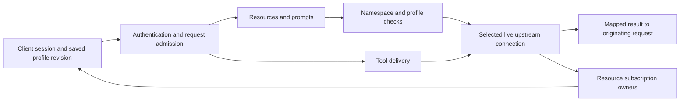

# MCP capabilities in the Phase 2 source

This matrix describes the current source implementation. Candidate13 has separate packaged functional acceptance, and installed LM Studio 0.4.21+2 has native tool-execution evidence; neither establishes that every primitive in this matrix was exercised through every client. Independent clean-machine acceptance and untested client versions remain open. See [Phase 2 acceptance status](PHASE2-STATUS.md) for artifact boundaries, results and limitations.

| Feature | Implemented behavior | Boundary |
| --- | --- | --- |
| Tools | Existing discovery modes, namespaced invocation, cancellation and request progress when the upstream path supplies it | FastMCP or another intermediate server must forward progress for its own composed calls; Harbor cannot infer it |
| Resources | `resources/list`, `resources/read`, `resources/templates/list`; text and base64 blob contents | Live running selected upstreams only; M5 dormant caching currently covers tools |
| Prompts | `prompts/list`, `prompts/get`, declared arguments and embedded resources | Live running selected upstreams only |
| List changes | Tools, resource and prompt list notifications to sessions exposing the capability | A catalog/lifecycle change may produce an extra refresh notification |
| Resource subscriptions | One upstream subscription per connection/URI, with separate client owners | Upstream must advertise subscriptions; restart/disconnection ends them. Subscribe again afterward |
| Progress | Request-specific upstream tokens are translated to the originating request's token | No fabricated progress; no forwarding to an arbitrary client |
| Cancellation | Propagates request/session cancellation to the active upstream request; queued work is cancelled without dispatch | Cancellation cannot prove that external side effects stopped |
| Sampling, elicitation, roots | Not advertised to upstreams; explicit unsupported-method errors | No speculative bidirectional routing |
| Completion, tasks, MCP Apps | Not advertised or implemented as gateway capabilities | No claim of full MCP support |

## Configure and verify

In **Profiles**, select the servers and the **tools**, **resources** and **prompts** capability checkboxes. Save the profile and reconnect the client. Existing sessions retain their saved profile revision. A capability excluded from that revision is absent from its initialization response and unavailable to its requests. Private discovery endpoints remain tools-only.

**Test connection** opens a real authenticated MCP session and lists enabled tools, resources, resource templates and prompts. It reports each count and warns when any upstream catalog failed. It then closes the test session. Separate process profiles start their configured native child processes for this test and clean them up when it ends. The test does not read resource contents, retrieve a prompt or invoke a tool.

The default endpoint exposes all three implemented primitive types. A running tools-only upstream is valid and simply contributes no resources or prompts. Reads and prompt retrieval do not implicitly start a dormant server. Start that server explicitly or use its approved on-demand tool path first.

## References and limits

Use the exact names and references returned by Harbor. Resource URIs and URI templates use `harbor-resource://<hex-encoded-server-id>/<original-reference>`. The nested reference remains verbatim, preserving template expressions, percent escapes, queries and fragments. Expand an RFC 6570 template as a template; do not normalize the nested URI through a browser URL parser. Prompts use `harbor/<hex-encoded-server-id>/<original-name>`. These reversible namespaces separate identical references from different servers.

Harbor rewrites the defined MCP resource fields in resource listings, template listings, read results, tool resource links, embedded tool resources and embedded prompt resources. Arbitrary text, JSON structured data and unrelated metadata are application data and are not recursively rewritten. A link remains tied to the server that supplied it; that server must support reading the referenced URI. A profile must allow resources as well as the originating server to read it.

Each upstream listing follows pagination with repeated-cursor detection, at most 1,000 pages, 10,000 items and 4 MiB of serialized page data. A combined public listing is bounded to 10,000 items and 4 MiB. Harbor returns this bounded combined listing without a cursor. An invented cursor produces a useful error. A malformed or excessive upstream catalog is excluded atomically; healthy catalogs remain available, with `harbor/listingErrors` in result metadata and details in Activity. Consumers must not interpret an incomplete listing as evidence that the omitted server has no capabilities.

Read/prompt/tool responses are schema-validated by the installed SDK and subject to a 4 MiB serialized response limit. This is a returned-result limit, not a transport-level streaming memory guarantee. Resource subscriptions are bounded to 128 per client owner and 2,048 distinct upstream resource subscriptions per manager. Public request/session admission limits still apply.

## Subscription ownership and failure

Repeated subscribe from the same session is idempotent. Shared sessions subscribe upstream once; an unsubscribe removes only the caller's ownership. The last owner triggers the upstream unsubscribe. Client termination, profile retirement and gateway shutdown release ownership. Separate process profiles have separate subscription managers and child processes.

Active resource/prompt requests count as upstream work. A subscription pins its upstream against automatic idle shutdown. Manual Stop still stops the selected server, invalidates its subscriptions and emits catalog changes; a new connection must be subscribed again. Harbor does not silently recreate potentially stale subscriptions after a restart. A cancelled or timed-out operation can leave its upstream outcome unknown. Automatic idle shutdown is then suspended until an explicit ownership reset, consistent with M5.

Malformed content fails the affected request or catalog. Unsupported sampling/elicitation requests receive explicit errors and are never routed to another session sharing the upstream. Subscriptions are not authorization boundaries: named profiles remain configuration boundaries under the shared gateway authentication policy.

## Protocol versions and compatibility evidence

Initialization uses the installed SDK's supported protocol versions and fallback version. Subsequent HTTP version headers, when present, must match that session's negotiation. Older clients receive resource links as text references instead of the newer content block, structured tool output as JSON text, and tool schemas without later-version fields. Audio content is represented by an explanatory text block for versions predating audio support. Resource read methods still accept the returned Harbor references.

Resource links and structured tool output were introduced in the [2025-06-18 MCP revision](https://modelcontextprotocol.io/specification/2025-06-18/changelog). The previous [2025-03-26 tool schema](https://modelcontextprotocol.io/specification/2025-03-26/server/tools) supports text, image, audio and embedded-resource content. The [resource protocol](https://modelcontextprotocol.io/specification/2025-11-25/server/resources) defines the separate listing, reading, template and subscription operations.

Local acceptance exercises real Node SDK clients, native stdio and managed HTTP/SSE upstreams, the exported stdio bridge, identical names across servers, binary resources, URI template expansion, profile revisions/process isolation, subscriptions, concurrent progress, cancellation and malformed content. Negotiation tests cover 2024-11-05, 2025-03-26, 2025-06-18 and 2025-11-25; supporting another version in the SDK alone is not separate acceptance evidence. The visible Electron acceptance uses saved controls, actual resource/prompt counts and real reads/retrieval. These fixtures establish protocol and lifecycle behavior, not universal third-party client compatibility.

